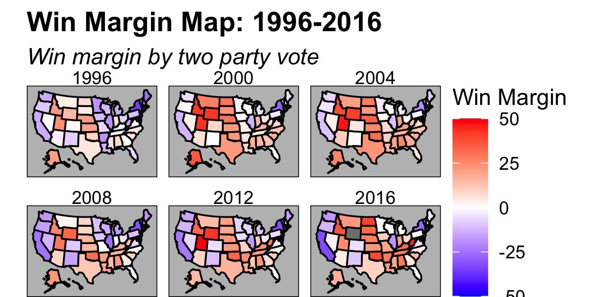
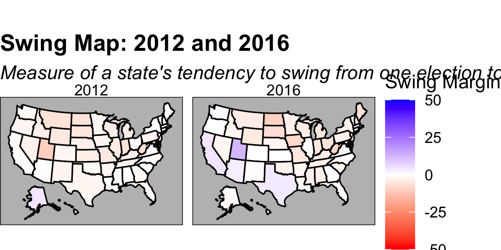

# Elections of the Past to Understand the Present: Popular Votes Shares and Swing Margins
### 9/14/20
### Carine Hajjar, cmhajjar@college.harvard.edu

The 2020 presidential is now 50 days away. Many have called it an election like no other - a fight for the soul of the country, even. With so much at stake, it's no wonder that election predictions are plastering the media. 
This week, I want to take a look at the history of electoral victories overtime using the two-party popular vote share as well as a "swing margin." What can these parameters tell us about the winning party? Can they help us predict the next winning party? Most of all, what can these parameters tell us about changes in the electorate?

I'll take a look at electoral data^[I use data that contains the national and state-by-state popular vote share from 1948-2016.] of the popular vote share in American since 1960 to grapple with these questions.

## Win Margins
Overtime, the win margin (based on the two-party popular vote share) for each party has shifted, but, overall, has stayed under 25% in favor of either Democrats or Republicans. The national win margin is a useful way to contextualize the favorability of a party on a national level come election time. It does not, however, tell the full story. State win margins fluctuate differently, indicating that party favorability is highly regional as well. Take a look at Texas' win margin which, since 1976, favors Republicans significantly more than the national win margin (1976 was the last Democratic win in Texas for the presidential election to date). On a national level, however, the popular vote is more highly-contested than in Texas. 

Thus it makes sense to look at win margins on a state-by-state basis: 

Win margins on a state-by-state basis overtime answer important questions: does a state consistently favor candidates from one party? Does a state's party preference fluctuate overtime? Which state is a deeply-entrenched red or blue territory? Knowing the answers to these questions are crucial to election prediction and campaigning. For instance, the Democratic party has refrained from costly campaigning in Texas since the 1980s. However, given an extremely narrow win margin for Republicans in the Cruz v. Beto 2018 Senate race, many have questioned whether or not Texas could become a "swing state." This matters.  In fact, the [Biden campaign](https://www.cbsnews.com/news/biden-campaign-texas-staff-resources/) purchased TV ads in and allocated more staff to the traditionally red state. 

## Swing Margins
Swing margins are also incredibly helpful in understanding the electoral changes that states undergo from one election cycle to the next. The "swing" I am talking about this week deals with the change in magnitude and direction a state's popular vote margin from one presidential election to the next. A larger magnitude of "swing" signals a higher change in electoral preference. 

According to [Butler and Van Beek](https://www.jstor.org/stable/420065) (1990), the swing illustrates a change in the electorate's behavior and naturally leads to the question: why are voters changing their preferences? 

In the 2016 election there are some notable swings. The states that swung right the most (in order of magnitude) were North Dakota, West Virginia, Iowa, South Dakota, and Maine. The states that swung left the most (in order of magnitude) were Utah, California, Texas, and Massachusetts. Notice that Texas swung left but then-candidate Trump won the popular. By swinging left I mean that the state had a smaller Republican vote share in 2016 than it had in 2012. 

## A Swing and a Miss

Intutitively, large swings signal that the electorate is unhappy with the prevailing party. However, [Butler and Van Beek](https://www.jstor.org/stable/420065) offer some caution: swings could be impacted by factors such as incumbency, region, or voter turnout. Swing is not necessarily a referendum on the ruling party. Rather, in [Butler and Van Beek's](https://www.jstor.org/stable/420065), "Swing provides a simple warning that a problem exists."

While swings should not be used for outright predictions, they may be useful in identifying states that are more volatile in their preferences. These "swingy" states are often targets for political campaigns. The Trump and Biden campaigns are certianly fixating on recently "swingy states" like Texas. 

