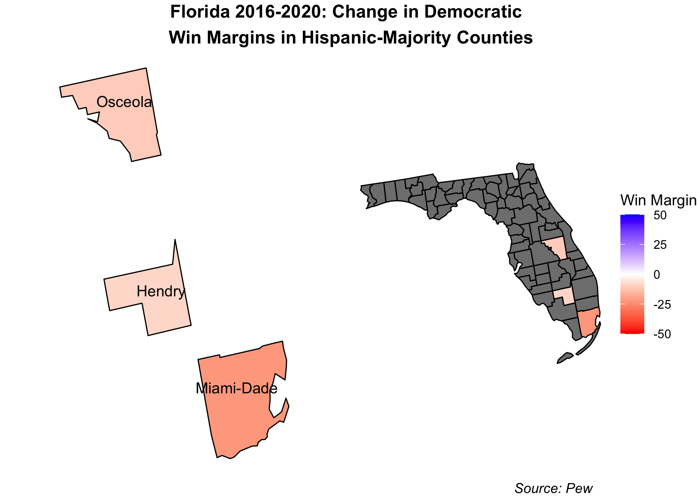

The narrative can be about any aspect of the campaign or election - anything that you find interesting -  just as long as it is being discussed in the public sphere.  A testable implication means that you are not attempting a definitive test of the truth of a narrative, which often involves difficult questions of causality and data that may not be available, but rather you are looking for initial evidence that the data is consistent or inconsistent with the claims.  A way to think about this is to say “if X is true, it would imply Y” and then go look for Y.  Y does not need to definitely prove or disprove X, only be one piece of evidence.

For your blog post, you should:
Summarize the narrative you are choosing to investigate and briefly explain why the narrative might be important to test  in the context of the various election-related variables we have discussed this semester.
Describe and justify a testable implication of this narrative. 
Describe the data you collected.
Describe the results of your test and whether it supports the narrative. This should include graphics.  

# Evaluating a Post-Election Narrative: Did Democrats Lose Big With Hispanics?
While most Latinos voted for Biden this election cycle, Democrats' hold on this traditionally blue block is [reportedly](https://www.vox.com/21551025/latino-national-vote-biden-trump-2020-florida-texas) slipping. Indeed, the Democratic vote share margin drastically contracted in places like the Rio Grande Valley in Texas and southern Florida. Meanwhile, Latinos in Arizona and California mostly voted blue, though some margins shrank in certain counties throughout these states. Overall, at least in Florida and Texas, Biden's performance fell flat in comparison to Clinton's run in 2016. 

Many have called for a reexamination of Democrats' approach to Latino voters. The main flaws being discussed seem to center around the following: 
1. The Latino vote is not a monolith blue bloc and cannot be taken for granted by Democrats
2. Democrats must tailor their Latino outreach to specific communities, much like the Trump campaign did 
3. The Trump campaign's emphasis on border safety as well as anti-socialism appealed directly to border counties in Texas and Cuban/Venezuelan/Nicaraguan communities in south Florida, respectively 
4. The Trump campaign's ground and air game in Latino-majority communities made a huge difference, especially in relation to Democrats' lack of resource allocation in these places 

This widespread conversation has prompted me to do a systematic analysis of Democrats' hold on the Latino vote. In this blog I explore and test the following narrative: Democrats are losing their grip on the Hispanic voter bloc due to their lack of tailored outreach and campaign resource allocation. I'll test this narrative doing the following: 
1. Looking at the relationship between the percentage of Hispanic residents in a Hispanic majority county and that county's 2020 Democratic vote share
2. Examining whether or not Democrats won in Hispanic-majority counties
3. Looking at the change between the 2016 and 2020 Democratic victory margin in Hispanic-majority counties
4. Examining the difference between the amount and content of Trump and Biden's Hispanic-targeted rhetoric 
5. Measuring the amount of campaign resources allocated to states with large Hispanic populations 

By examining these factors, we'll also be able to look at the importance of things like ground game, campaign ads, and campaign messaging. 

## The Aftermath: 2020 Winners in Hispanic-Majority Counties 
In this post I'll be looking at counties defined by [Pew](https://www.pewresearch.org/fact-tank/2019/11/20/in-a-rising-number-of-u-s-counties-hispanic-and-black-americans-are-the-majority/) (using US census data) as having majority Hispanic residents. (I omit Bronx county from New York due to lack of data.)

Below, we see the county-by-county breakdown of the popular vote. The strength of the color is positively correlated with the vote share for Republicans (red) or Democrats (blue):

Democrats seems to have stronger holds on Hispanic populations in California, Arizona, and just marginally, in Florida. Trump has a strong hold on West Texas, losing out to Biden in the Gulf. Trump also won broadly in Hispanic counties in Washington and Kansas. 

This map, in no way, shows a red sweep for Trump in Hispanic communities. It does, however, indicate that the Hispanic voting bloc is *not a monolith* and that communities in different parts of the county vote quite distinctly. 

But does this map indicate huge loses for Biden? Interestingly, Florida, which was touted as a huge failure for Democrats, still went blue in two out of three Hispanic-majority counties. While this may detract from the narrative of a Democratic failure, it does not say much about the change in Democratic vote share since 2016. 

## Vote Shares are Dwindling
While Democrats did not necessarily lose stronghold Hispanic counties, like Miami-Dade, they did *significantly shrink their margins of victory* since 2016. The map below looks at the magnitude of these contractions: 

At first glance, Democrats lost many voters in the Rio Grande Valley in Texas as well as in south Florida. They gained some voters in California and, more subtly, in Kansas and Washington. Arizona Hispanic-majority counties saw less Democratic support while New Mexico was a mixed bag.

Let's take a closer look at some of these states. 

### Texas

Democrats saw steep contractions in their victory margins along the southern border. Though most of these counties still went for Biden (see my first figure), the shrinking margins certainly carry a message, especically in such a notable geographic area. These border counties are the most intimately linked to Trump's "Wall" and immigration agenda. Their shift in voting may mean that Trump's "law and order" rhetoric and his emphasis on secure border resonates with the Hispanic residents in those communities.

### Florida
Florida seems to be at the center of the media narrative surrounding the Dems' failure among Hispanics. More specifically, Miami-Dade county, which saw a sizeable contraction in its Democratic support since 2020, has been drawing plenty of attention due to the demographic makeup of its Hispanic community. Miami-Dade and many other southern Floridian counties have large Cuban, Venezuelan, and Nicaraguan populations. The Venezuelan demographic, in particular, has continued to increase in 2016 as a result of the instability and mismanagement of Maduro's socialist regime. As the daughter of a Venezuelan immigrant, I have seen many of my family members and friends reallocate from Caracas to the Miami area in the past few years. 

These specific communities have either recently (in the case of Venezuelans and Nicaraguans) or historically (in the case of Cubans) fled from socialist dictatorships in their ancestral counties. Trump's ability to brand Democrats as socialists may very well have resonated with these voters, compelling them to swap their previously blue votes for Trump. 

Moreover, the [Trump campaign](https://www.nbcnews.com/news/latino/trump-cultivated-latino-vote-florida-it-paid-n1246226) had rallies and targeted ground presence in this key swing states, specifically catering to Hispanic voters. For instance, the Latinos for Trump coalition started in Florida as early as June 2019. Biden's campaigning in the state was less targeted and concentrated later in the election cycle. 

Why did they do better in Arizona?
invested more in ground game and voter registration efforts, more Latino community outreach

