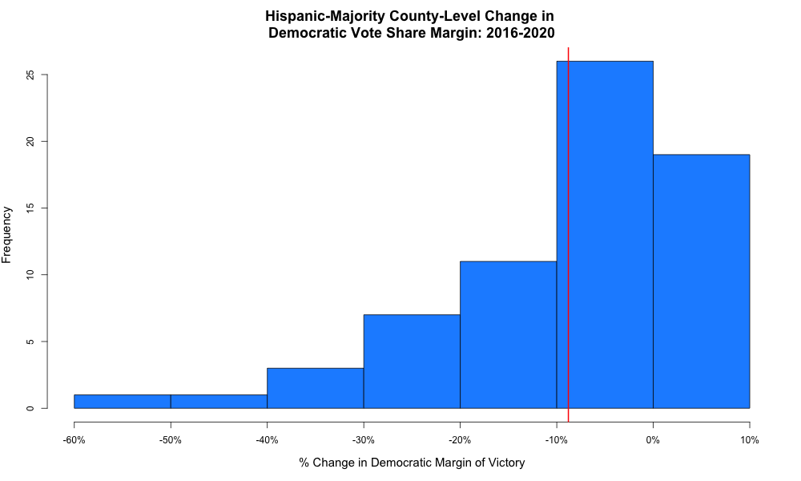
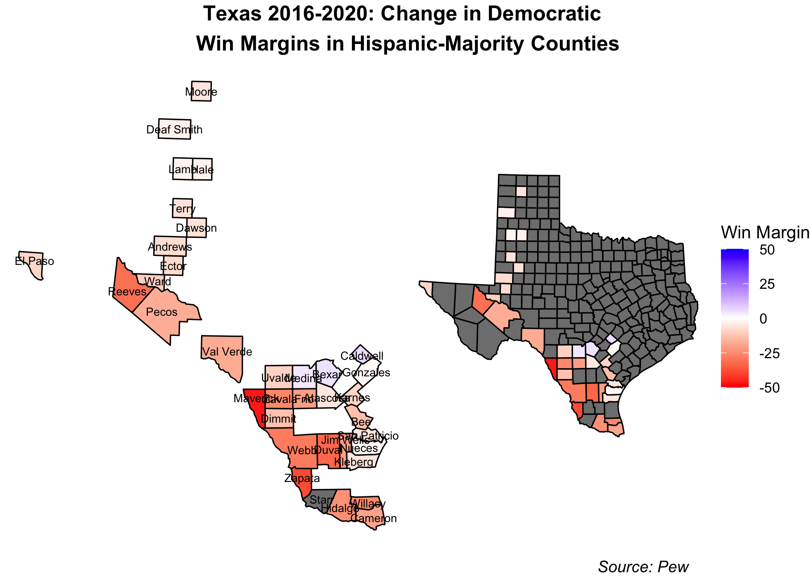
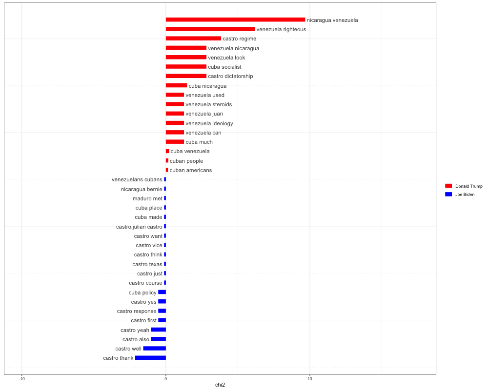

The narrative can be about any aspect of the campaign or election - anything that you find interesting -  just as long as it is being discussed in the public sphere.  A testable implication means that you are not attempting a definitive test of the truth of a narrative, which often involves difficult questions of causality and data that may not be available, but rather you are looking for initial evidence that the data is consistent or inconsistent with the claims.  A way to think about this is to say “if X is true, it would imply Y” and then go look for Y.  Y does not need to definitely prove or disprove X, only be one piece of evidence.

For your blog post, you should:
Summarize the narrative you are choosing to investigate and briefly explain why the narrative might be important to test  in the context of the various election-related variables we have discussed this semester.
Describe and justify a testable implication of this narrative. 
Describe the data you collected.
Describe the results of your test and whether it supports the narrative. This should include graphics.  

# Evaluating a Post-Election Narrative: Did Democrats Lose Big With Hispanics?
While most Latinos voted for Biden this election cycle, Democrats' hold on this traditionally blue block is [reportedly](https://www.vox.com/21551025/latino-national-vote-biden-trump-2020-florida-texas) slipping. Indeed, the Democratic vote share margin drastically contracted in places like the Rio Grande Valley in Texas and southern Florida. Meanwhile, Latinos in Arizona and California mostly voted blue, though some margins shrank in certain counties throughout these states. Overall, at least in Florida and Texas, Biden's performance fell flat in comparison to Clinton's run in 2016. 

Many have called for a reexamination of Democrats' approach to Latino voters. The main flaws being discussed seem to center around the following: 
1. The Latino vote is not a monolith blue bloc and cannot be taken for granted by Democrats
2. Democrats must tailor their Latino outreach to specific communities, much like the Trump campaign did 
3. The Trump campaign's emphasis on border safety as well as anti-socialism appealed directly to border counties in Texas and Cuban/Venezuelan/Nicaraguan communities in south Florida, respectively 
4. The Trump campaign's air game in Latino-majority communities made a huge difference, especially in relation to Democrats' lack of resource allocation in these places 

This widespread conversation has prompted me to do a systematic analysis of Democrats' hold on the Latino vote. In this blog I explore and test the following narrative: Democrats are losing their grip on the Hispanic voter bloc due to their lack of tailored outreach and campaign resource allocation. I'll test this narrative doing the following: 
1. Looking at the relationship between the percentage of Hispanic residents in a Hispanic majority county and that county's 2020 Democratic vote share
2. Examining whether or not Democrats won in Hispanic-majority counties
3. Looking at the change between the 2016 and 2020 Democratic victory margin in Hispanic-majority counties
4. Examining the difference between the amount and content of Trump and Biden's Hispanic-targeted rhetoric 
5. Measuring the amount of campaign resources allocated to states with large Hispanic populations 

By examining these factors, we'll also be able to look at the importance of things like ground game, campaign ads, and campaign messaging. 

## The Aftermath: 2020 Winners in Hispanic-Majority Counties 
In this post I'll be looking at counties defined by [Pew](https://www.pewresearch.org/fact-tank/2019/11/20/in-a-rising-number-of-u-s-counties-hispanic-and-black-americans-are-the-majority/) (using US census data) as having majority Hispanic residents. (I omit Bronx county from New York due to lack of data.)

Below, we see the county-by-county breakdown of the popular vote. The strength of the color is positively correlated with the vote share for Republicans (red) or Democrats (blue):

Democrats seems to have stronger holds on Hispanic populations in California, Arizona, and just marginally, in Florida. Trump has a strong hold on West Texas, losing out to Biden in the Gulf. Trump also won broadly in Hispanic counties in Washington and Kansas. 

This map, in no way, shows a red sweep for Trump in Hispanic communities. It does, however, indicate that the Hispanic voting bloc is *not a monolith* and that communities in different parts of the county vote quite distinctly. 

But does this map indicate huge loses for Biden? Interestingly, Florida, which was touted as a huge failure for Democrats, still went blue in two out of three Hispanic-majority counties. While this may detract from the narrative of a Democratic failure, it does not say much about the change in Democratic vote share since 2016. 

## Vote Shares are Dwindling
Overall, there was a positive relationship between the percentage of Hispanic citizens in a Hispanic-majority county and the 2020 Democratic vote share. This lines up with Biden's support among two thirds of Hispanic voters. 

Nevertheless, Trump's hold on ]one third (32%)](https://www.theatlantic.com/ideas/archive/2020/11/how-trump-grew-his-support-among-latinos/617033/) of Hispanic voters is an improvement from 2016, where he only gained 28% support, and signals a flaw in the Dems' outreach and messaging toward Hispanic voters across different communities. In Hispanic-majority counties, Democrats, on average, lost *almost ten points* in their victory margins since 2016: 

While Democrats did not necessarily lose stronghold Hispanic counties, like Miami-Dade, they did *significantly shrink their margins of victory.* This map geographically represents these contractions: 

At first glance, Democrats lost many voters in the Rio Grande Valley in Texas as well as in south Florida. They gained some voters in California and, more subtly, in Kansas and Washington. Arizona Hispanic-majority counties saw less Democratic support while New Mexico was a mixed bag.

Let's take a closer look at some of the states that experiences this loss in Democratic votes. 

### Texas

Democrats saw steep contractions in their victory margins along the southern border. Though most of these counties still went for Biden (see my first figure), the shrinking margins certainly carry a message, especially in such a notable geographic area. These border counties are the most intimately linked to Trump's "Wall" and immigration agenda. Their shift in voting may mean that Trump's "law and order" rhetoric and his emphasis on secure border resonates with the Hispanic residents in those communities.

### Florida

Florida seems to be at the center of the media narrative surrounding the Dems' failure among Hispanics. More specifically, Miami-Dade county, which saw a sizable contraction in its Democratic support since 2020, has been drawing plenty of attention due to the demographic makeup of its Hispanic community. Miami-Dade and many other southern Floridian counties have large Cuban, Venezuelan, and Nicaraguan populations. The Venezuelan demographic, in particular, has continued to increase in 2016 as a result of the instability and mismanagement of Maduro's socialist regime. As the daughter of a Venezuelan immigrant, I have seen many of my family members and friends reallocate from Caracas to the Miami area in the past few years. 

These specific communities have either recently (in the case of Venezuelans and Nicaraguans) or historically (in the case of Cubans) fled from socialist dictatorships in their ancestral counties. Trump's ability to brand Democrats as socialists may very well have resonated with these voters, compelling them to swap their previously blue votes for Trump. 

Moreover, the [Trump campaign](https://www.nbcnews.com/news/latino/trump-cultivated-latino-vote-florida-it-paid-n1246226) had rallies and targeted ground presence in this key swing states, specifically catering to Hispanic voters. For instance, the Latinos for Trump coalition started in Florida as early as June 2019. Biden's campaigning in the state was less targeted and concentrated later in the election cycle. 

### Arizona

Arizona, like Florida, had blue counties lose some of their vote share to Trump. As border counties, perhaps these were groups of voters that liked Trump's "law and order"/secure border agenda. 

It is worth noting that Arizona, which unlike Florida, remained blue and had [exceptional ground outreach](https://www.nbcnews.com/news/latino/years-making-established-latino-groups-helped-biden-arizona-nevada-n1246864) by the Biden campaign among Hispanic voters in relation to other states with large Hispanic populations. There were also established outreach networks already in place in Arizona as well as Nevada that mobilized in support of the Biden campaign. 

## So what happened?
So far I've established that while Biden still won most Hispanic-majority counties and Democrats do fairly well in these places, Trump did take a sizeable chunk out of the blue win margin. I propose two possible reasons for this (which I briefly mentioned above in my state-by-state analysis):
1. Trump's rhetoric aligned with different Hispanic communities 
2. Trump's ground game and ad campaigns were more effective and better tailored towards different Hispanic communities

### Rhetoric
Trump's relative success with Hispanic populations may be linked to his emphasis on issues that align with these populations' values. For instance it is thought that Trump's fear-mongering around Biden's potential socialist agenda drove up Republican support in Florida where many Cuban and Venezuelan immigrants have settled. 

#### Southern Florida
Using a word cloud of words and phrases used in Biden and Trump's campaign speeches, it becomes clear that Trump places a greater emphasis on socialism and communism throughout his speeches: 
  

 
 

  
Overall, Trump also spoke more to issues around socialism and socialist regimes in places like Cuba, Venezuela, and Nicaragua than Biden:

  

 
  

  
 
 
#### Border Communities
While this rhetoric certainly resonated with south Florida residents, what about Hispanic populations in the Rio Grande Valley who are of predominantly Mexican descent? Did something about Trump's rhetoric especially resonate with them? I hypothesize that his "law and order"/border security agenda appealed to border communities experiencing border-related crime. 

  

 
  

  

In this case, Biden did not necessarily speak less about the topic of the border and immigration, but his rhetoric was completely different. While Trump emphasized border security, a wall, and gang violence, Biden spoke mostly about immigration reform and immigrant rights. Given that Biden's vote share was smaller than Clinton's in 2016 in these counties, it's reasonable to believe that these are communities that value "border security" before reform. 

This may have also been the case in border counties in Arizona and New Mexico which also saw shrinking vote shares on Democrats in Hispanic-majority communities (though Biden won both states). These are also predominantly Mexican communities. 

Perhaps the strongest evidence for Trump's rhetorical success on the border is in Imperial County on California's southern border. While most other Hispanic-majority counties in California either increased their democratic vote share or stayed around the same, this 80% Hispanic county on the US-Mexican border increased its vote share for Trump since 2016. This implies that something about Trump's border rhetoric appealed to more members of this community than it did in 2016 (though it did vote blue in the end). 

Overall, most Hispanic-majority border counties across Texas, New Mexico, and Arizona remained blue (see first map). However, **each of these counties saw a contraction in the Democratic victory margin since 2016.**

### Campaign Resources
Was rhetoric the only factor or did campaign resource allocation also help shrink Democrats' vote shares? I take a look at TV ad airings and Facebook ad purchases to seek an answer. 

#### TV Ads
A potential explanation for Trump's rising Hispanic vote share could be his superior outreach via campaign ads. Was this the case?

Interestingly, we see the Biden campaign consistently outspending Trump in states where there are Hispanic-majority counties and large Hispanic communities in general. However, as I describe above, it may not be the ads themselves that are winning over voters. Rather, it may be that the *content* of the candidates' message. In this vein, Trump's rhetoric may be enough to eat away at Biden's Hispanic vote share despite spending less on TV ads. Additionally, Trump's ground outreach may have been better. His campaign did more rallies and door-knocking than Biden's. 

#### Facebook Ads
- theory that these have more impact because more spreadable 

