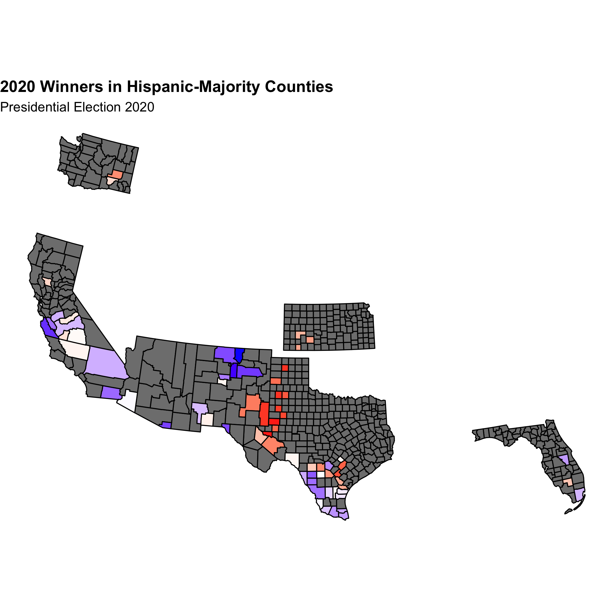
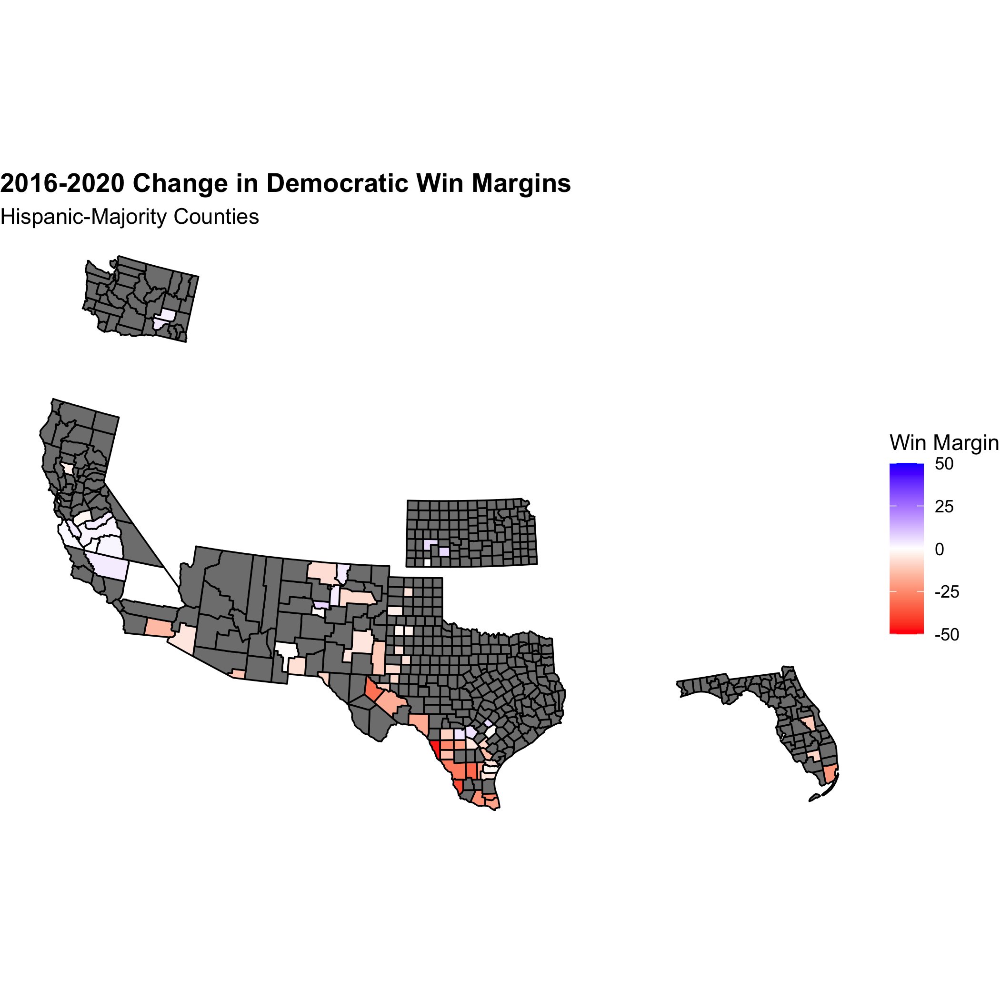
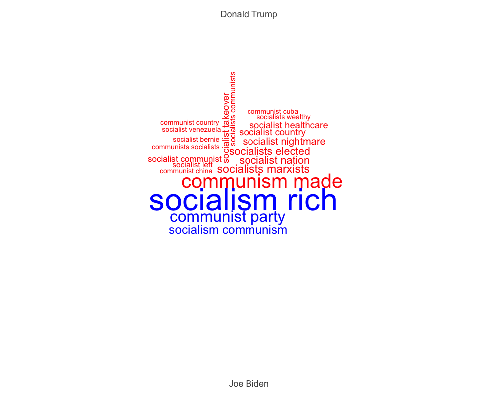
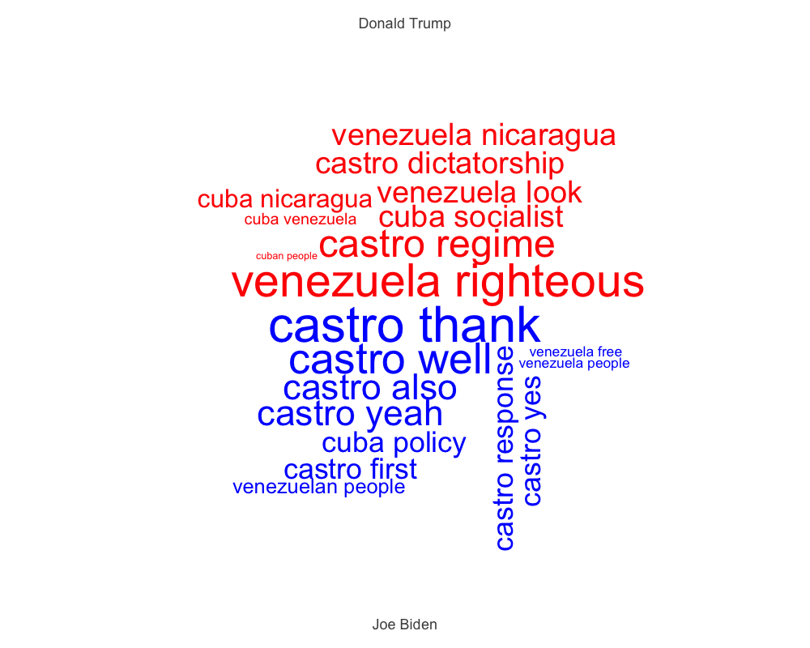
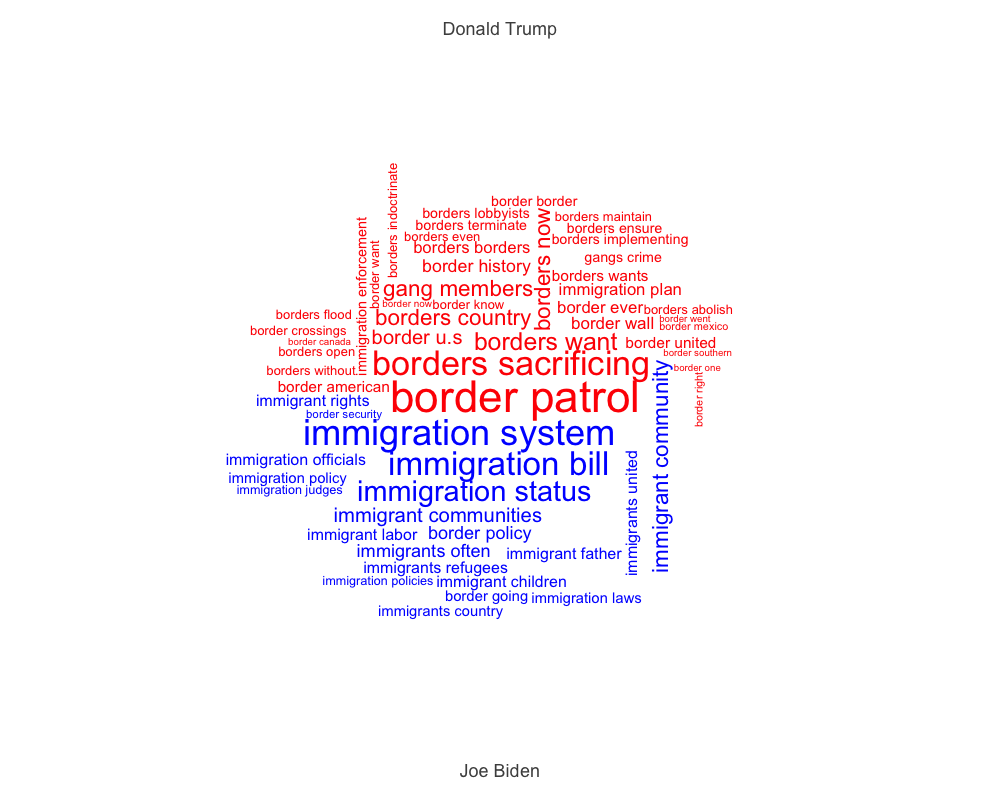

# Evaluating a Post-Election Narrative: Did Democrats Lose Big With Hispanics?
While most Latinos voted for Biden this election cycle, Democrats' hold on this traditionally blue block is [reportedly](https://www.vox.com/21551025/latino-national-vote-biden-trump-2020-florida-texas) slipping. Indeed, the Democratic vote share margin drastically contracted in places like the Rio Grande Valley in Texas and southern Florida. Meanwhile, Latinos in Arizona and California mostly voted blue, though some margins shrank in certain counties throughout these states. Overall, at least in Florida and Texas, Biden's performance fell flat in comparison to Clinton's run in 2016. 

Many have called for a reexamination of Democrats' approach to Latino voters. The main flaws being discussed seem to center around the following: 
1. The Latino vote is not a monolith blue bloc and cannot be taken for granted by Democrats
2. Democrats must tailor their Latino outreach to specific communities and their unique needs, much like the Trump campaign did 
 The Trump campaign's emphasis on border safety as well as anti-socialism appealed directly to border counties in Texas and Cuban/Venezuelan/Nicaraguan communities in south Florida, respectively 
3. The Trump campaign's ground game in Latino-majority communities made a huge difference, especially in relation to Democrats' lack of resource allocation in these places 

This widespread conversation has prompted me to do a systematic analysis of Democrats' hold on the Latino vote. In this blog I explore and test the following narrative: **Democrats are losing their grip on the Hispanic voter bloc** which I hypothesize is due to their lack of tailored outreach and campaign resource allocation. I'll test this narrative doing the following: 
1. Looking at the relationship between the percentage of Hispanic residents in a Hispanic majority county and that county's 2020 Democratic vote share
2. Examining whether or not Democrats won in Hispanic-majority counties
3. Looking at the change between the 2016 and 2020 Democratic victory margin in Hispanic-majority counties
4. Examining the difference between the amount/content of Trump and Biden's Hispanic-targeted rhetoric 
5. Measuring the amount of campaign resources (TV ads and ground game) allocated to states with large Hispanic populations 

By examining these factors, we'll also be able to look at the importance of things like ground game, campaign ads, and campaign messaging. 

Understanding the Latino vote is increasingly important as America trends towards being a majority-minority country, with the Latino demographic as one of the fastest-growing blocs. Democrats and Republicans alike should have an interest in understanding the needs of this expanding voter bloc. 

## The Aftermath: 2020 Winners in Hispanic-Majority Counties 
In this post I'll be looking at counties defined by [Pew](https://www.pewresearch.org/fact-tank/2019/11/20/in-a-rising-number-of-u-s-counties-hispanic-and-black-americans-are-the-majority/) (using US census data) as having majority Hispanic residents. (I omit Bronx county from New York due to lack of data.)

Below, we see the county-by-county breakdown of the popular vote. The strength of the color is positively correlated with the vote share for Republicans (red) or Democrats (blue):

Democrats seems to have stronger holds on Hispanic populations in California, Arizona, and just marginally, in Florida. Trump has a strong hold on West Texas, losing out to Biden in the Gulf. Trump also won broadly in Hispanic counties in Washington and Kansas. 

This map, in no way, shows a red sweep for Trump in Hispanic communities. It does, however, indicate that the Hispanic voting bloc is *not a monolith* and that communities in different parts of the county vote quite distinctly. 

But does this map indicate huge loses for Biden? Interestingly, Florida, which was touted as a huge failure for Democrats, still went blue in two out of three Hispanic-majority counties. While this may detract from the narrative of a Democratic failure, it does not say much about the change in Democratic vote share since 2016. 

## Vote Shares are Dwindling
Overall, there was a positive relationship between the percentage of Hispanic citizens in a Hispanic-majority county and the 2020 Democratic vote share. This lines up with Biden's support among two thirds of Hispanic voters. 

Nevertheless, Trump's hold on ]one third (32%)](https://www.theatlantic.com/ideas/archive/2020/11/how-trump-grew-his-support-among-latinos/617033/) of Hispanic voters is an improvement from 2016, where he only gained 28% support, and signals a flaw in the Dems' outreach and messaging toward Hispanic voters across different communities. In Hispanic-majority counties, Democrats, on average, lost *almost ten points* in their victory margins since 2016: 

While Democrats did not necessarily lose stronghold Hispanic counties, like Miami-Dade, they did *significantly shrink their margins of victory.* This map geographically represents these contractions: 

At first glance, Democrats lost many voters in the Rio Grande Valley in Texas as well as in south Florida. They gained some voters in California and, more subtly, in Kansas and Washington. Arizona Hispanic-majority counties saw less Democratic support while New Mexico was a mixed bag.

Let's take a closer look at some of the states that experiences this loss in Democratic votes. 

### Texas

Democrats saw steep contractions in their victory margins along the southern border. Though most of these counties still went for Biden (see my first figure), the shrinking margins certainly carry a message, especially in such a notable geographic area. These border counties are the most intimately linked to Trump's "Wall" and immigration agenda. Their shift in voting may mean that Trump's "law and order" rhetoric and his emphasis on secure border resonates with the Hispanic residents in those communities.

### Florida

Florida seems to be at the center of the media narrative surrounding the Dems' failure among Hispanics. More specifically, Miami-Dade county, which saw a sizable contraction in its Democratic support since 2020, has been drawing plenty of attention due to the demographic makeup of its Hispanic community. Miami-Dade and many other southern Floridian counties have large Cuban, Venezuelan, and Nicaraguan populations. The Venezuelan demographic, in particular, has continued to increase in 2016 as a result of the instability and mismanagement of Maduro's socialist regime. As the daughter of a Venezuelan immigrant, I have seen many of my family members and friends reallocate from Caracas to the Miami area in the past few years. 

These specific communities have either recently (in the case of Venezuelans and Nicaraguans) or historically (in the case of Cubans) fled from socialist dictatorships in their ancestral counties. Trump's ability to brand Democrats as socialists may very well have resonated with these voters, compelling them to swap their previously blue votes for Trump. 

Moreover, the [Trump campaign](https://www.nbcnews.com/news/latino/trump-cultivated-latino-vote-florida-it-paid-n1246226) had rallies and targeted ground presence in this key swing states, specifically catering to Hispanic voters. For instance, the Latinos for Trump coalition started in Florida as early as June 2019. Biden's campaigning in the state was less targeted and concentrated later in the election cycle. 

### Arizona

Arizona, like Florida, had blue counties lose some of their vote share to Trump. As border counties, perhaps these were groups of voters that liked Trump's "law and order"/secure border agenda. 

It is worth noting that Arizona, which unlike Florida, remained blue and had [exceptional ground outreach](https://www.nbcnews.com/news/latino/years-making-established-latino-groups-helped-biden-arizona-nevada-n1246864) by the Biden campaign among Hispanic voters in relation to other states with large Hispanic populations. There were also established outreach networks already in place in Arizona as well as Nevada that mobilized in support of the Biden campaign. 

## So what happened?
So far I've established that while Biden still won most Hispanic-majority counties and Democrats do fairly well in these places, Trump did take a sizeable chunk out of the blue win margin. I propose two possible reasons for this (which I briefly mentioned above in my state-by-state analysis):
1. Trump's ground game and ad campaigns were more effective and better tailored towards different Hispanic communities
2. Trump's rhetoric aligned with different Hispanic communities 

### Reason 1: Campaign Resources
Did insufficient campaign resource allocation shrink Democrats' vote shares? Did Trump do a better job on TV and on the ground? I take a look at data about TV ad airings as well as news coverage about ground game to seek an answer. 

#### TV Ads
A potential explanation for Trump's rising Hispanic vote share could be his superior outreach via campaign ads. Was this the case?

Interestingly, we see the Biden campaign mostly outspending Trump in states where there are Hispanic-majority counties and large Hispanic communities in general. I am hesitant to draw any conclusions from this graph, however, because it is state-wide, not county-wide data, and does not show any clear correlation between winners and TV airings. Moreover, as I've discussed in past blog posts, ads are not necessarily as effective as campaigns would hope. They are most effective when shows consistently up until an election. This would have to be the case in the Hispanic counties I looked at and unfortunately. there is not enough data available yet to verify the consistency and frequency of TV ad airings in these places. 

Because of these uncertainties, it may not be the ads themselves that are winning over voters. Rather, it may be that the *content* of the candidates' message. In this vein, Trump's rhetoric may be enough to eat away at Biden's Hispanic vote share despite spending less on TV ads. Additionally, Trump's ground outreach may have been better. His campaign did more rallies and door-knocking than Biden's. 

#### Ground Game
Overall, Trump gained ground in Hispanic counties where Biden ground game was weak. 

In Texas, for example, Trump's ground game was much stronger among Hispanic communities in the southern part of the state. An [*LA Times*](https://www.latimes.com/politics/story/2020-11-05/election-2020-latino-votes-democrats) article detailed the more extensive outreach effort among more conservative Hispanic communities in Texas who have benefited from Trump's increase in Border Patrol and oilfield jobs. 

Trump's [ground game](https://www.npr.org/2020/10/26/927453369/outspent-in-the-homestretch-trump-campaign-says-its-ground-game-is-stronger), especially in places like Florida, was sizable compared to Biden's. Though the Biden campaign outspent Trump, volunteer outreach was a key factor in winning Florida for Trump and presumably in making inroads with Hispanics in the state. 

Biden's victory in Arizona, especially among Hispanics, may be the strongest evidence of his campaign's ground game flaws. In Arizona, Biden had strong Hispanic organizing groups already in place mobilizing for the Democratic ticket. This was not the case in places like Florida and Texas where his vote share was especially eroded. 

### Reason 2: Rhetoric
More than anything, Trump's relative success with Hispanic populations may be linked to his emphasis on issues that align with these populations' values. For instance it is thought that Trump's fear-mongering around Biden's potential socialist agenda drove up Republican support in Florida where many Cuban and Venezuelan immigrants have settled. 

#### At First Glance
Using a speech processing function in R, I filtered for the words "Hispanic", "Latino", and "Spanish" as well as similar iterations of these words. 

Overall, Trump spoke more frequently about the Hispanic community than Biden. He also often used words like "love" and "prosperity," coming across a bit warmer and more attentive. However, we need to take a closer look at the tone and content of Trump and Biden's speeches. Sure, Trump spoke *more* about Hispanics, but what exactly did he say? The Latino vote is not a monolith, therefore I take a look at words and phrases that would appeal to different Latino voter blocs throughout the country, focusing on Florida and Texas. 

#### Southern Florida
Filtering for different iterations of communism and socialism in the candidates' speeches, it becomes clear that Trump places a greater emphasis on socialism and communism, specifically linked to the Left. 

Trump's use of phrases like "socialist takeover", "socialist agenda", and "socialist country" presumably created fear around Democrats' vision for the country, especially among a demographic that has such recent and horrible associations with communism and socialism. He also used these words more frequently than Biden, drilling in the idea and cementing the fear of a "socialist country. 

Trump also spoke more to issues around socialism and socialist regimes in places like Cuba, Venezuela, and Nicaragua than Biden:

Biden hardly speaks about dictators that come from the country of origin of many Hispanic Americans. Meanwhile, Trump frequently condemns these dictators, linking them to idelogy ("Venezuela ideology") and presumably to Democrats and their more progressive agenda. 

 
#### Border Communities
While this rhetoric certainly resonated with south Florida residents, what about Hispanic populations in the Rio Grande Valley who are of predominantly Mexican descent? Did something about Trump's rhetoric especially resonate with them? I hypothesize that his "law and order"/border security agenda appealed to border communities experiencing border-related crime. 

In this case, Biden did not necessarily speak less about the topic of the border and immigration, but his rhetoric was completely different. While Trump emphasized border security, a wall, and gang violence, Biden spoke mostly about immigration reform and immigrant rights. Given that Biden's vote share was smaller than Clinton's in 2016 in these counties, it's reasonable to believe that these are communities that value "border security" before reform. 

This may have also been the case in border counties in Arizona and New Mexico which also saw shrinking vote shares on Democrats in Hispanic-majority communities (though Biden won both states). These are also predominantly Mexican communities. 

Perhaps the strongest evidence for Trump's rhetorical success on the border is in Imperial County on California's southern border. While most other Hispanic-majority counties in California either increased their democratic vote share or stayed around the same, this 80% Hispanic county on the US-Mexican border increased its vote share for Trump since 2016. This implies that something about Trump's border rhetoric appealed to more members of this community than it did in 2016 (though it did vote blue in the end). 

Overall, most Hispanic-majority border counties across Texas, New Mexico, and Arizona remained blue (see first map). However, **each of these counties saw a contraction in the Democratic victory margin since 2016.**

## Takeaways
Overall, I come away with these major points from my analysis:
1. TV ads say very little about Hispanic turnout 
2. Trump did better with Hispanics in Florida and Texas because of a superior ground game while Biden did better in Arizona for the same reason 
3. The tone and message of Trump's speeches appealed more to Hispanics than in 2016 
4. Trump's speeches show that he touched on specific interest areas among the Hispanic community while Biden stayed general 
5. Trump spoke more about the Hispanic community in more heterogeneous terms than Biden

Putting my campaign resource and speech analysis together, I conclude that Trump, more than Biden, catered to the heterogeneous interests across different Hispanic groups. His message about the border in Texas or socialism in Florida appealed directly to groups in those states, making these same groups feel forsaken by the Biden campaign, who largely took the Hispanic vote for granted. Coming back to my narrative, it is abundantly clear that Democrats did show they are losing touch with Hispanic voters and even taking them for granted. 

