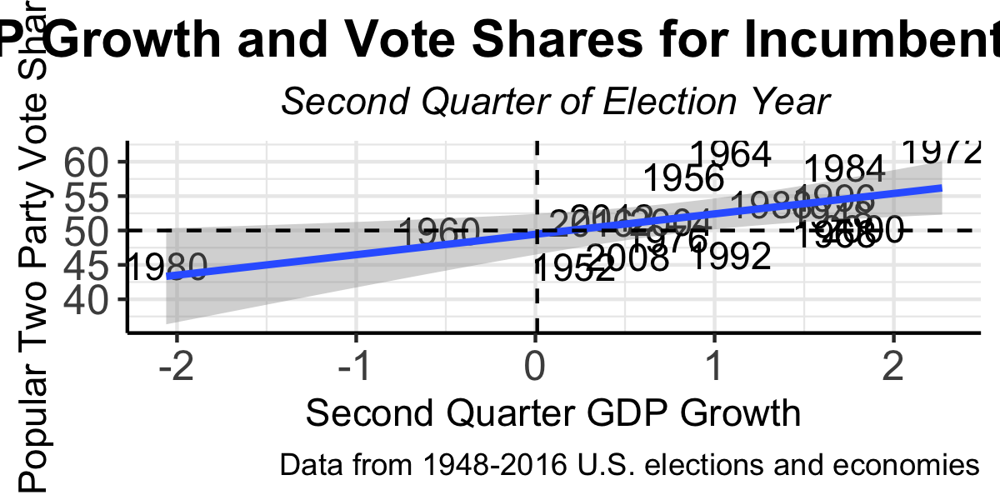
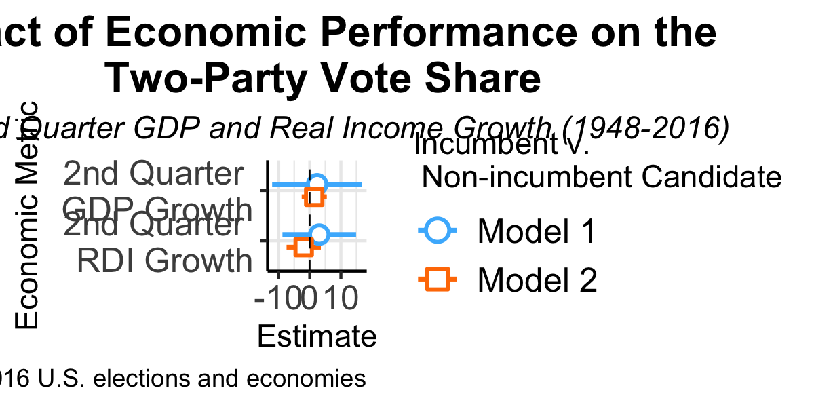
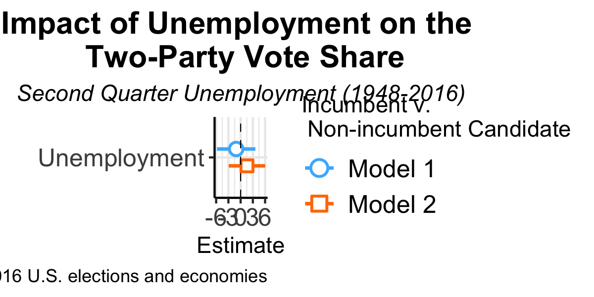

# The Economy and Elections: Money Makes the World Go 'Round
Today I want to consider a classic predictor of electoral outcomes: the economy. Over the history of American presidential elections, economic conditions have been a key criteria in the electorate's choice for their next president. Therefore, understanding the dynamic between the economy and the electorate is a critical component of election forecasting. 

With a critical election around the corner amidst an unprecedented economic shock, I am keen to understand the link between the presidency and the economy. Today I will engage with the following questions:
- How does the predicitive power of the economy impact an incumbent candidate? A non-incumbent candidate? 
- Does the predicitive power change with different metrics of economic success? 
- Does the predictive power of economy in determining an electoral outcome change across time? If so, why? 
- What might the pandemic economy tell us about the November election?

From my analysis below, I've come to the following conclusions: 
- A good economy almost certainly helps incumbents 
- Voters reward or punish with their votes (or lack thereof) using a short term retrospective analysis
- Good economies may actually **punish** non-incumbents in terms of the vote share
  

# The Economy and Elections Overtime
There's a clear graphical correlation between economic performance and the reelection of incumbent candidates. This makes sense: if GDP or real incomes are growing, voters are likely to "reward" incumbents with a vote. This was cetainly the case in 2012 and 2016 which fall almost perfectly on the predictive line for popular vote share as predicted by GDP growth. 

It's important to note, however, that GDP growth isn't the only metric for economic performance. Above, I use GDP growth to model incumbent wins. Here, more consistent with [Achen and Bartel's(2017)](https://muse-jhu-edu.ezp-prod1.hul.harvard.edu/book/64646) study, I'll use growth rates in real income (which they believe to be a better indication of electoral preference in the popular vote share than GDP growth) in the short-term and long-term of a presidential election. When I use real income change to predict elections, 2012 is highly consistent with the model though 2016 is a bit farther off. 

Overall, though there is some variation from election to election, these models tell us that incumbent winners are likely associated with a GDP or personal real income growth in their election year. It's important to note, however, that timeline matters. GDP or real income growth in the quarter concurrent with incumbent reelection is actually a stronger predictor than overall economic performance in a presidency, consistent with Achen and Bartels' assessment of economic voting. Achen and Bartels as well as various other political scientists note that voters retrospectively assess incumbents using the short run. Specifically, the relationship between two-party popular vote share and economic conditions are most correlated in the second quarter of an election year. 

Some key take-aways: 
- Positive GDP and real income growth are associated with incumbent reelections 
- Real income growth is one of many alternative measures of economic performance used to predict election outcomes
- Short-term economic conditions are a stronger predictor than long-term presidential economic performance

# The Economy and Incumbency 
Now that we've established the predicitive power of the economy in an election, it's important to consider another predicitive aspect - incumbency. 

Model 1 looks at the relationship between the two party vote share and economic performance (measured in either GDP or real income). The blue line is for incumbents and the orange is for non-incumbents. For an incumbent president running for reelection, both measures of economic performance (in the second quarter of the election year) are positively correlated with vote share - incumbent candidates with good short-term economic performance get votes. 

Meanwhile, positive (short-term) economic performance may actually **not** benefit all candidates. Non-incumbent candidates may actually suffer if the economy is doing well. While second quarter GDP growth is positively correlated with vote share (though the relationship is weaker than with an incumbent), second quarter real income growth (Achen and Bartel's prefered metric) is **negatively** correlated with popular vote share. This tells me that when a sitting president oversees a booming economy voters will stay with the incumbent, rewarding them for a good economy and electoraly punishing challenger candidates. 

There's a similar trend with unemployment: when unemployment is low in the short-term, incumbents get a larger vote share. Meanwhile, challenger candidates actually **lose** vote share as a result of this economic success and voters remain with the politician that has secured a good economy. This is rather consistent with risk-averse behavior. 

Some key take-aways:
- Short-term economic success benefits incumbents running for reelection more than non-incumbents running for office 
- Non-incumbents may actually **lose** vote share due to economic success during an incumbent's (short-term) tenure in office

