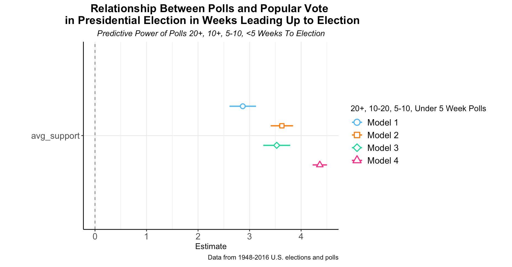
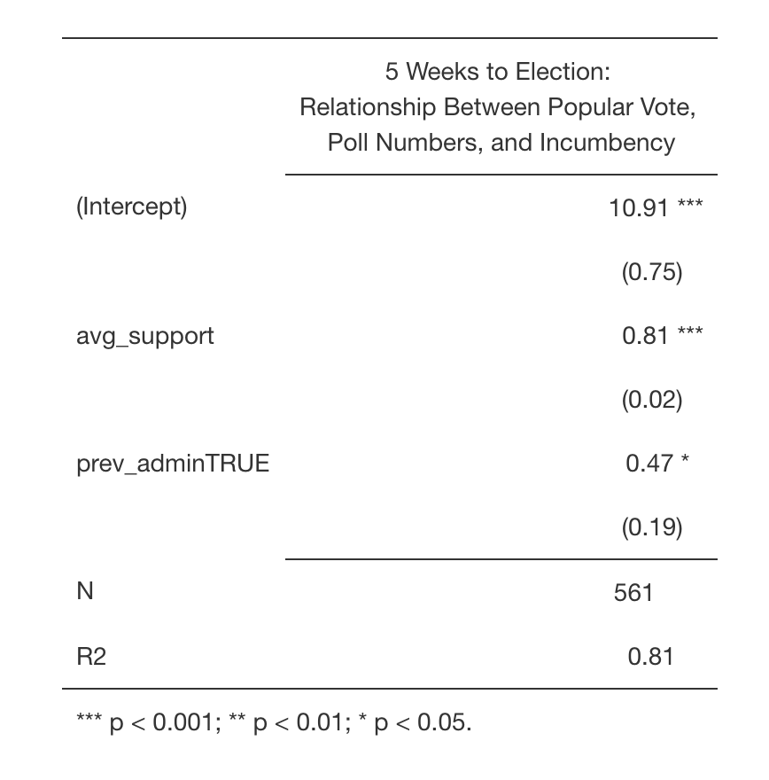

# Timing is Everything: Polls and Election Outcomes  
If you've watched the news, listened to a podcast, opened a snapchat, scrolled throughout Instagram, or perused your Facebook feed in the past year, chances are you've been bombarded with poll numbers. "Biden is up X points!" "Trump is leading in this week's polls!" 

Phrases like these seem so determinant: if a poll says it, it must be true. In reality, however, elections are decided by many factors and polls can't be the only factor in predicting the election. If you've been following along with my other posts, fundamental factors like economic performance or incumbency often decide elections before they even occur. [READING?] Therefore, polls, it seems, could be utterly redundant. Can't you just take a look at GDP? It turns out it's more complicated than that: polls can be useful in measuring the present feeling among voters and often reflect fluctuations in short-term approval of candidates, spiking and falling for scandals, breaking news, and convetion excitement. These short-term reflections are not totally useful in predicting the end of an election - they seldom endure. We voters are ficle creatures. Moreover, though polls reflect momentary reactions to notable events, they also lack spikes and falls for other important events. 

So why, then, am I writing this blog post? It turns out that polls, overall, can still be important predictors of an outcome. But take them with a grain of salt. When looking at a poll here are some key factors to consider: 
- what's the sample size?
- what question was asked?
- is the poll national or state-based?
- how closely was the poll taken to the election? *(we'll explore this question in detail today)*

The answer to the questions determine the **bias** of the poll. Bias is often the reason a singular poll is not the most reliable. Following [guy's] logic, averaging as many polls as possible helps better predict an election outcome and has in past elections. Another possible remedy to poll uncertainty is **timing.** According to Gelman and King, over the course of the campaigning period, voters more clearly solidify their preferences as they gather more and more information on the candidates in question. Following this logic, reelatively sound polls should become more and more reflective of voter's final decisions, and therefore the election outcome, as the election day draws nearer. To test this claim, I will engage with the following question: do polls become more accurate (more reflective of the final outcome) as they are conducted closer to election day?

With the following models, I'll establish the following about the timing of a poll in its relation to predicting an election: 
- the closer a poll is to an election, the more certainty it has 
- the closer a poll is to an election, the more it correlates with the election outcome 

## Winners and Losers 
In the following plots, I take a look at a regression explaining the relationship between the popular vote and the (polled) average approval at the time of the poll. On the left, the regression looks at this relationship among winning candidates, and on the right, it examines losing candidates. I run this regression at four different time periods: 20+ weeks before an election, 10-20 weeks before an election, 5-10 weeks before an election, and under 5 weeks before an election. 

The plots show that there is certainly a positive relationship between the poll-predicted popular vote and the actual popular vote. While it's visually difficult to tell if prdictions and outcomes converge as polls approach election date, there is a noticeable convergence when comparing the 20+ week plot and the under 5 week plot. Preliminarily, this supports my hypothesis that polls become more predictive as election day nears. 

In order to cut down on any visual confusion above, I also plot the coefficients from a regression of popular vote outcome and poll-predicted popular vote outcome from those four periods:

Here we see that polls taken 20+ weeks before election day are less predictive and less certain (it has a wider horizontal bar which indicates higher uncertainty) than the polls taken under 5 weeks before election day. This certainly makes sense given Gelman and King's assertion. There is, however, some abiguity with the polls from 10 and 5-10 weeks from election day. Below I take an even closer look at the regression: 

Based on the R^{2} measurement, overall, as polls approach election day, their prediction fit the actual outcome more closely. The predictive power of 10-20 and 5-10 week-from-election-day polls are virtually the same. 

## The Final Countdown 
Now that I have established that polls conducted closer to election day are a closer fit to the actual election outcome, I'll look specifically at a model that uses polled average approval (predicted popular vote) from 5 weeks and under from election day and incumbency to explain popular vote outcomes. 

## The Moral of the Story 
The moral of the story is, don't get worked up about polls early on. In fact, maybe don't pay attention to them at all...maybe not until October, that is! 
