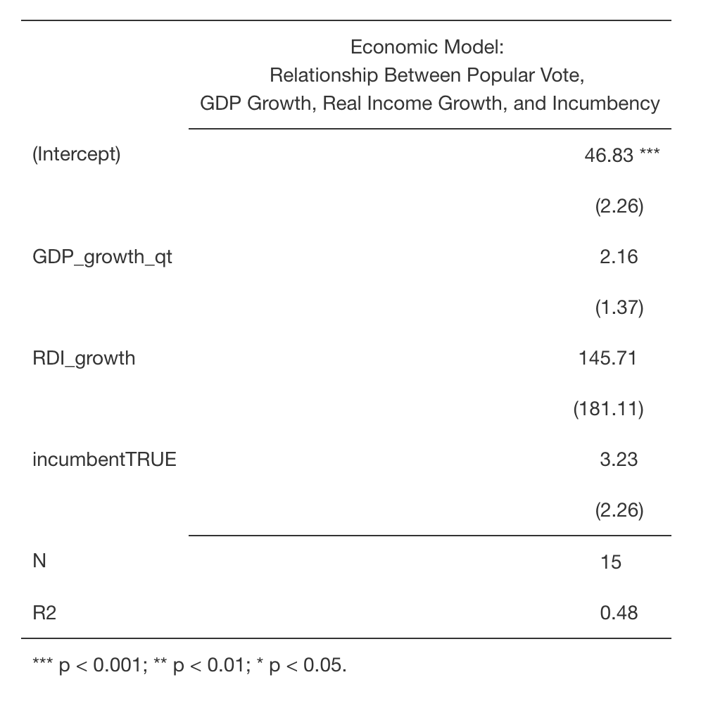
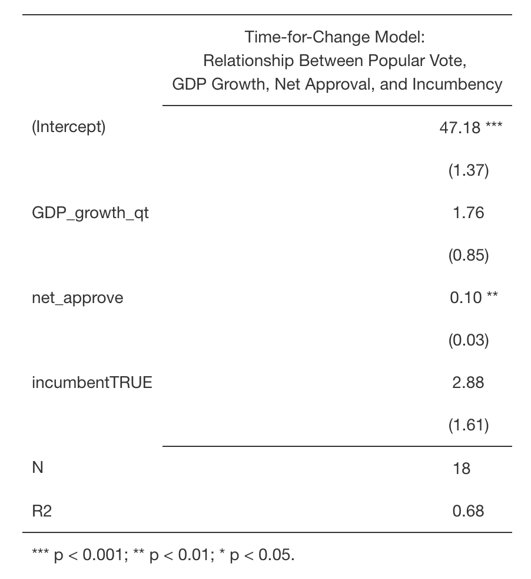

# Prediction Models: Time-for-Change
The 2016 election came as a shock to many forecasters - their models had gotten it wrong. Well, most of them had gotten it wrong. There were a few that predicted a Trump presidency, including [Alan Abramowitz's time-for-change model](https://www-cambridge-org.ezp-prod1.hul.harvard.edu/core/services/aop-cambridge-core/content/view/6DC38DD5F6346385A7C72C15EA08CA09/S1049096516001268a.pdf/will_time_for_change_mean_time_for_trump.pdf). Since 1992, the time-for-change model has predicted popular vote with a prediction error of just 1.7%. It uses second quarter GDP growth, Gallup job approval ratings, and whether or not a candidate is running for an incumbent party to predict the winner of the popular vote. 

The model touches on many important questions about forecasting: how important is incumbency, the economy, popular sentiment, campaigning, and publicity? Which matters the most? Abramowitz asserts a model that relies on the funamentals: economic health, incumbency, and job approval. This is essentially a retrospective model. When looking at an incumbent party's candidate, voters think back on how the candidate (or their party) did in office. This diminishes the role of campaigning, debates, and the like. 

In this blog post I will assess Abramowitz's model and compare it to a fundamentals model of my own. I'll also look at correlations between economic performance or job approval and popular vote. In the end I find the following: 
- Economic factors are strong predictors, but not as strong as the multifacetted Abramowitz model 
- Economic performance is a stronger predictor for Republican incumbents 
- Time-for-change is a robust, stable model that could very well predict the upcoming election

## Breaking Down the Fundamentals
In my previous blogs, I've talked about the predictive power of economic metrics and factors like incumbency. Abramowitz looks at these as well as net approval. Since I had not yet investigated the relationship between popular vote for incumbents and Gallup approval, I decided to "deconstruct" time-for-change graphically to gain a better understanding:

The figure shows that, indeed, fundamentals are predictive of elections. 2016, especially, falls close to predictions using the economy and job approval, respectively. Interestingly, economic performance (measured in GDP growth in the 2nd quarter of an election year) has a stronger positive relationship with Republican incumbents than Democrat incumbents. I would guess that the reason for this is that Republican candidates generally emphasize the economy more than Democrats. Gallup net job approval, on the other hand, is almost equally positively correlated with incumbent popular votes. This is quite intuitive - the more the public approves of a sitting president, the more likely they are to be elected. Partisanship is less salient in this case. 

## Different Models
In a previous blog post, I looked at an economic model that used second quarter GDP and real income growth and incumbecy to predict the two-party popular vote. For the most part, the economy is a historically robust predictor of election outcomes. Another important factor is timing - [Achen and Bartels](https://muse-jhu-edu.ezp-prod1.hul.harvard.edu/book/64646) note that voters consider the immediate economic conditions under the sitting president when voting at the polls. They also use real income growth instead of the classic economic indicator, GDP growth. Taking this into account, I create a model that uses *both* RDI (real income) and GDP to predict incumbents' popular vote. 

This model shows that economic growth in the short run, whether measured by GDP or RDI, is positively correlated with popular vote share for incumbents.

How does the time-for-change model compare?

The model positively associates short term GDP growth, job approval, and incumbency with an incumbent party's candidate's vote share. One point of GDP growth is associated with a 1.76 point increase in popular vote (with 0.85 standard erros). Net approval is a smaller coefficient but is also statistically significant. One point increase in job approval is associated with a 0.10 point increase in popular vote (with an error of 0.03 standard errors). Being a sitting president is hugely advantageous, associated with a 2.88 point increase (with 1.61 standard errors). 

Both models tell us that fundamentals like the economy, job performance, and incumbency are important predictors. And we've seen that factors such as these closely predicted elections like 2016 (in plot above). However, the question still remains, which model is better?

## Time-for-Change versus my Economic Model 
To compare these models, I took a look at the difference between the predicted popular vote outcome and the actual outcome: 

Visually, the time-for-change model looks like a closer prediction. The residuals (difference between prediction and actual outcome) look smaller than in the economic model. But there are plenty of points and the visual representation can be a bit confusing. 

I take an even closer look using the outsample error method.

When I take a random subset of the sample out of the model and fit the model to the remainder, I find that the predictive performance of the time-for-change model is more robust than my economic model. I ran a cross-validation simulation 1000 times with various different out-sampled data sets and found that the mean out-sample error (difference between actual outcome and out-sample-predicted outcome) is about 2.75 points higher in the economic model. 

Below, I graphically represent the distribution of mean out-sample residuals across 1000 replications for both models: 

The figure confirms that the time-for-change model is more robust. The distribution of its mean residuals from the cross-validation are closer to and more concentrated around zero, meaning that the predicted outcome is closer to the actual outcome than in the economic model. 

## Models: My Big Takeaways
Today I looked at my economic model against the time-for-change model and also looked at different components of each model, correlating them with popular vote outcome. This is what I found: 
- The economic performance is positively correlated with an incumbent's popular vote (in the short run). 
  - The relationship is stronger among Republican incumbents. 
- Gallup job approval is positively correlated with popular vote outcome for incumbents (and the effect is similar across Democrat and Republican incumbents). 
- The time-for-change model is a robust predictor of an candidate's popular vote share when they are from an incumbent party. 

So what does Ambramowitz's model say about November? Unlike 2016, [Abramowitz](https://centerforpolitics.org/crystalball/articles/its-the-pandemic-stupid-a-simplified-model-for-forecasting-the-2020-presidential-election/) predicts a Biden victory, though Trump has a chance, largely dependent on raising his job approval. 

