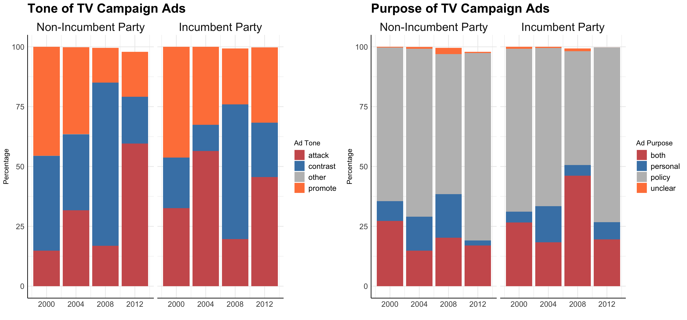

# Air Wars: The Fight for Media??
Every presidential election, *millions* of dollars are spent on campaign ads, whether that be on TV, the radio, social media, or elsewhere. Campaigns use all of these forms of media to meet voters where they're at and persuade them from the comfort of their own homes or on their own social media feeds to 1) vote and 2) vote for their candidate.

Today I'll be taking a general look at the use of ads over different elections, their purpose, their location, and the money spent on them. I ask the following questions: 
  1. How much do elections spend on ads? (gen graph of spent by state)
  2. Where do ads go? (states AND swing states)
  3. What do ads do? (purpose)
  4. How does incumbency impact the "Air War"? 
  5. What's the latest with 2020? 
  6. What does this all mean? Does it matter? 
  
  It's important to note that data on the current ad spending is limited so I'll be using restrospective analysis to look at the general properties of the Air War. 
  
## Big Spenders 
In the 2012 election, over *1 billion dollars* was spent on TV ads. 

  - *As an interesting side note, there is an interesting pattern emerging with incumbency: years with incumbents running for reelection (2004 and 2012) have relatively higher spending than years when two new candidates are running (2000 and 2008). This could be explained by the well-known phenomena of incumbent advantage. Incumbency, afterall, is one of the strongest predictors of popular vote.* 
  
Media campaigning, as we can see, takes a bulk of a campaign's monetary resources. Given this major expense, campaigns are as strategic as possible with their placement of TV ads.

#### Where's the Money Going?
Looking at state-by-state spending gives us a better idea of how campaigns strategically employ their resources in the form of ads. 

The first thing to notice is that TV ad spending has increased over time. 2012 is far "darker" than 2000. This could indicate tighter races, more TV use, or a shift in campaigning towards more media-centric persuasion. My instinct tells me that since 2000, since campaigns have become tighter and more divisive in a more polarized environment, campaigns are just generally more active and receiving more funding.  

What we also see here is that major battleground states — most notably, Florida — receive the bulk of campaign ad spending. This intuitively makes sense: why would either the GOP or Democratic Party spend millions on Massachusetts ads if MA has gone blue in the presidential election since 1988 and surely will remain blue? Campaigns strategically allocate their ad spending to states where the vote share margin is *expected* to be the smallest. Take a look at 2012: Ohio, Florida, Iowa, Nebraska, and other [Politico-designated](https://www.politico.com/2012-election/swing-state/) swing states received large sums of campaign ad money. Meanwhile, Massachusetts, which was firmly expected to vote for Obama, got little to no ad money.  

CHECK ON THIS 

Seeing that battleground states receive the biggest spending, I wanted to check if there was any correlation with swing states using the measure I computed in blog 1. What I found is that there is a slight negative correlation between a state's "swinginess" and its level of campaign ad spending. I found this odd - shouldn't swing states, like battleground states, be the target of major campaigning? Are swing and battleground synonymous? It turns out that campaigns are spending the bulk of their TV budget on lesser-swing states. This could mean a couple things. Given the fact that swing is calculated retrospectively, perhaps campaigns are just choosing the wrong states as battelground targets. Another possibility could be that campaigns are unsure about what states will swing and by how much, so they stay safe and place their bets with less volatile states. 

## Incumbency and Ads
Last week I spent some time talking about incumbency and its impact on electoral outcomes. Incumbency is seen as a major advantage in elections and is a successful predictor of popular vote outcomes. Given these realities, I wondered if incumbency (specifically party incumbency) would impact ad spending *and* ad content. 

#### Spending 

What we see is that challenger parties consistently outspend incumbent parties both over multiple elections *and* over the course of the election. I suspect that this is because challenger campaigns know they are facing the well-established incumbency advantage and have to fight an uphill battle. 

#### Does Ad Spending Even Matter?
Another important feature of the graph above: *both* incumbents and non-incumbents spend more and more as they near election day. This is consistent with PAPER's observation that ads are persuasive, but their impact decays almost immediately. Therefore, as PAPER notes, campaigns with frequent, sustained ads will be able to maintain their persuasion of voters and hopefully turn out more support on election day. By buying more ads closer to election day, campaigns are maintaining their persuasiveness more productively and in a more cost-effective manner.  

#### Ad Composition
Assuming that challengers know they have an uphill battle and pour more resources into TV ads, I wondered if they also opted for a certain type of ad that would help take down the already-advantaged incumbent. 

At first glance, incumbency or non-incumbency does not show a relationship pattern with any particular ad tone or ad purpose. I take a closer look at the top two tones (attack and contrast) and the top ad purpose (policy) to get a better understanding of incumbency and ad composition. 

Again, I don't see a clear trend between incumbency and tone/purpose of ads. My initial prediction was that non-incumbents would have disproportionately favored attack ads that zeroed in on policy for the following reasons:
  1. The incumbent has an advantage, so "attacking" can help narrow the gap
  2. The incumbent's policies are well-established after a term in office so a challenger would have to especially focus on conveying their agenda

While my predictions proved incorrect in the 2000-2012 elections, perhaps there is some helpful insight for future campaigns: focusing on attacking an incumbent and conveying a challenger's policy could help a challenger campaign shrink the incumbent advantage. 

## 2020 Update
With a firm overview of TV campaigning under our belt, it's time to take a quick look at 2020! While there's limited data on current social media spending, Facebook has started to release its data on presidential ad purchases. These are purchases not only made by the official campaigns, but other PACs and organizations behind either candidate. 

[Projected](https://www.nytimes.com/live/2020/battleground-states-2020-election) swing states like Florida, Pennsylvania, North Carolina, and even Texas are getting the bulk of FB ad spending to date. Interestingly California has a heavy amount of spending though it is firmly projected to vote Biden. 

