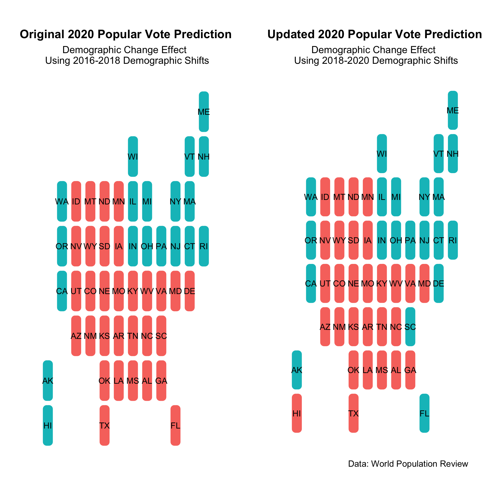
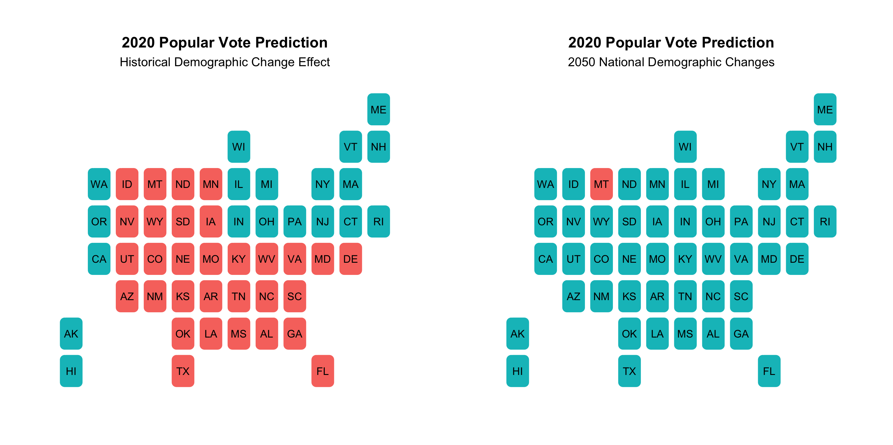

# Demographics: Race and Votes 
This week, I'm exploring the predictive power of demographic shifts in electoral outcomes. While I use a model that incorporates shifts in age, race, and gender demographics, I will pay particular attention to race, bearing in mind the major shifts that this country is experiencing and will continue to experience for the next few decades. Specifically, according to this [American Enterprise report](https://www.aei.org/research-products/report/states-change-demographic-evolution-american-electorate-1974-2060/), and various other projects, America is trending towards becoming a majority-minority country. Some notable trends include the shrinking of the working class white population and the rise of the Hispanic population. In fact, according to this Pew report, Hispanics are now the largest minority voting group. This has huge implications for states like Texas, which is trending more purple every year. 

Currently, Pew projects 2020 national race demographics to be the following:
- White: 66.7%
- Hispanic: 13.3%
- Black: 12.5%
- Asian: 4.7%

Their projections for [2050](https://www.pewresearch.org/hispanic/2008/02/11/us-population-projections-2005-2050/) confirm a trend toward majority-minority: 
- White: 47% 
- Hispanic: 29%
- Black: 13% 
- Asian: 9%

This week I wonder how quickly-changing demographics will impact elections. Specifically, I explore the following: 
1. What do past demographics predict for this election's popular vote? Its electoral votes?
2. What do current demographics predict for this election's popular vote? Its electoral votes?
3. If Trump and Biden were running in a majority-minority America (like the projected 2050 America), who would win this election? 

## 2016-2018 Demographics Predicting This Election
In order the understand how race, gender, and age demographics could predict November's popular vote outcome, you would often have to fetch data from prior years. Given census cycles, it's quite difficult to get an exact, annual state-by-state demographic report. For this reason, the model that predicts the popular vote outcome on the left panel uses demographic shifts from 2016 to 2018, factoring *percentage changes* in the following groups: 
- Black, Hispanic, and Asian racial groups
- Gender
- People ages 30-45, 45-65, and 65+

While the right panel offers a useful prediction with fairly recent data, I went searching for 2020 demographics, hoping to get an even more accurate prediction for November. While I did not find data on gender or age *(so I marked the percentage change from 2018-2020 as 0)*, I did find data on the Hispanic, Black, and Asian demographics of 2020 from [World Population Review](https://worldpopulationreview.com/states/states-by-race). Using a percentage change in these groups from 2018 to present, I predict the popular vote outcome in the right panel. 

#### Electoral Outcomes
The models predicting with 2016-2018 data and 2018-2020 data pick up different states for both parties. While they are broadly the same, Republicans win the popular vote in Hawaii with the more recent data and Democrats pick up Delaware, South Carolina, and Florida. While this suggests a broader shift toward the left, it's important to count electoral votes. 

By translating the popular majority winners in each state to electoral votes, I find that **Trump wins** in the **first model**: 

However, **Biden wins** with the more **updated demographic data**: 

This is not surprising. If even in the short run, the country is trending toward a majority-minority country, Democrats would on average have more electoral success given their historically higher appeal among minority groups. 

As for Trump winning with the 2016-2018 demographics, this also makes sense. These were, after all, close to the demographics that Trump won with in 2016. 

## Who Would Win in 2050 America? 
Fast forward to 2050. The country is going to be a far more diverse place, meaning there will be a more diverse electorate. Again, I'll look at shifts in racial demographics to imagine a Trump-Biden election with a 2050 electorate. 

Disclaimer: There are not state-by-state demographic projections, only national. Therefore, unlike the prediction above, which plugs in new state-by-state demographic changes, I will calculate the percentage change of racial makeup from 2018 to 2020, proportionally applying the change to the respective demographic categories' coefficients in the predictive model. While this is not as accurate as my methods above, this is an interesting exploration of the impact demographics have on electoral outcomes. 

Compared to the original prediction (using 2016-2018 data), the 2050 demographic predictions paint a startling, but logical, picture: an almost entirely Democratic country. The electoral votes also confirm that Trump, a Republican, would not be able to win an election in 2050. 

 
