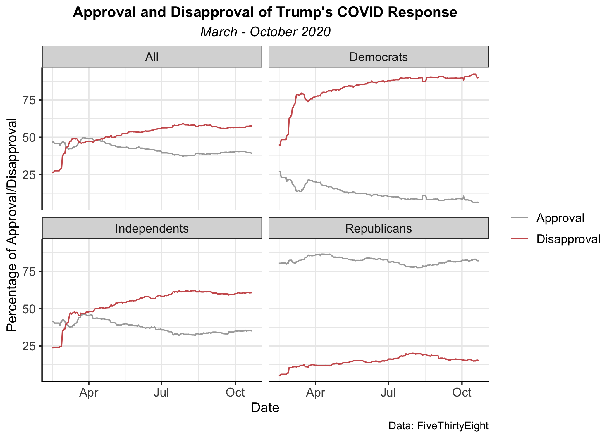
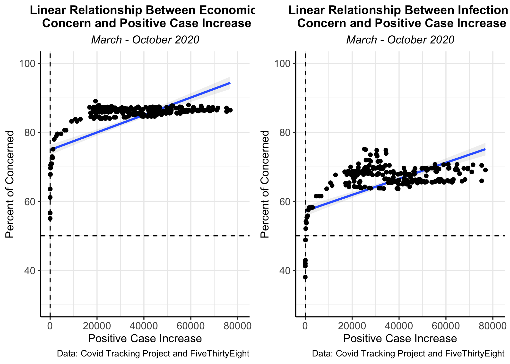
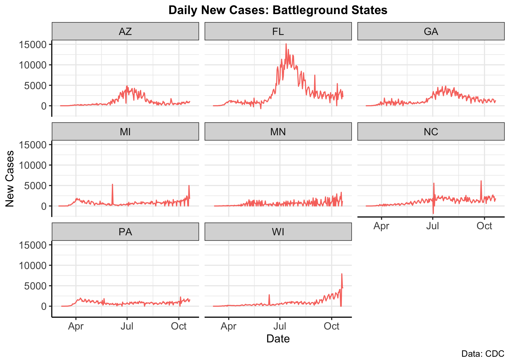

# 2020: Election Shocks 
How do unexpected events before an election impact votes? Do these "shocks" hurt candidates? There's seeminly no better time to consider these questions than 2020. With a pandemic, subsequent economic shock, and the infection of the President himself, the months leading up to November have been abundant with "shocks." 

Today I want to consider the possible impact that these shocks may have on the 2020 election outcome. Unfortunately, shocks cannot be convincingly predicted with prior data because each shock is different. There's never been anything quite like the Covid-19 pandemic - its timing, its economic impact, its emotional impact are all unprecendented. So modeling vote share with prior elections could be rather tricky. What I can do, however, is look at the impact the pandemic is having **now** on the American people and what these impacts **could** mean for the 2020 electoral outcome. 

I'll be considering the following questions: 
1. How has the pandemic impacted Trump's approval rating? How does this vary across party?
2. How do Americans feel about Trump's Covid response? 
3. What concerns Americans about the pandemic? Is it infection? Is it economic impacts?
4. What can national approval ratings tell us about performance in battelground states? 

### Trump's Handling of Covid: Americans' Take 
To no one's surprise, I find that approval and disapproval are partisan issues, meaning that any "shock" to the electoral outcome would have polarized effects. More specifically, Republicans are more approving (and less disapproving) of Trump's handling of Covid while democrats are more disapproving (and less approving). Nationally and among independents, many of which are "swing voters," disapproval eclipsed approval back in March, leaving an under-twenty-point gap between approval and disapproval on the national level. Nevertheless, as long as disapproval is on average higher than approval, Trump should face overall negative effects from this "shock" among non-Republicans. The question is whether or not this negative effect is enough to lose him the election and how many votes it could cost. 

## Accountability: Case Increase and Approval
On the national level we see a clear relationship between case increase and approval of Trump's Covid response. 

There is a slight negative correlation between the daily increase in Covid cases and the approval rating of the president's handling of the pandemic. While the outcome is statistically significant, it appears that approval drops by less than 1% with a positive change of 1 extra case. 

Is this surprising? Shouldn't Covid response approval drop more noticeably case Covid cases rise? At first, that is what I suspected, but zooming out, it's important to remember that these are national numbers. The US has been hit by Covid in different places at different times, so perhaps, any negative effect of a case spike in one area is cancelled out by another region that has not experienced the negative impacts of Covid. 

There are also plenty of confounders. Polarization, the economy, Trump's policy responses outside of Covid, and campaign tactics may all be shifting measures of the president's approval on Covid.

Overall, however, I would predict that a continual increase of daily case increases will have an overall **negative** effect on Trump's reelection campaign, especially given that most Americans disapprove of this Covid response. 

## Concern: Americans' Reaction to Covid 
What about American's concern? Will this concern impact the way citizens vote in November?

I wanted to know what kinds of concern emerged from rising cases. By looking at a linear regression with economic concerns as the dependent variable and positive case increases as the independent variable, I found that there is a positive relationship between the two variables. The same is true when I swapped economic concern with concern about the infection. This intuitively makes sense: Covid has been attack both the health of American citizens and the American economy. 

The graphs, however, tell a different story: cases and concern to not have a linear relationship. Though both variable have an overall positive correlation, it is not completely fit to my linear model. 

The graphs show an interesting trend where concern (either economic or infection-based) increases sharply until approximately 10,000 positive case increases per day. After this large number, any increase in cases does not have a huge effect - the majority of those who are concerned will remain concerned. This means that after a certain threshold of daily case increases, concern remains more or less fixed.

Something important to note about these two graphs: a larger percentage of Americans are worried about the economy than the infection. This makes sense: while some communities have been untouched by the virus and others may see it as a "hoax," the **entire** country is facing an economic downturn and unemployment. 

Finally, in weeks past, I have discussed the powerful predictive properties of economic performance. Namely, incumbents with strong economies tend to do better than those without. While this figure and regression does not use a typical measure of economic performance (like GDP or real income growth), it does reflect the economic concern Americans are feeling as the virus grows. Overall, I interpret high levels of economic concern as a negative sign for the Trump campaign. 

## Battleground Approval Ratings 

If Covid has an electoral effect, these are the states where candidates should be the most attentive. According to Politico, Arizona, Florida, Georgia, Michigan, Minnesota, North Carolina, Pennsylvania, and Wisconsin are 2020's key battleground states. Here are their daily case increases: 

Using the national correlation between case increases and Trump response approval, this is what I predict Trump response approval to be in each state using October's average daily increase in each battelground state. While this is not totally accurate, as it uses national correlations (since there are not state-by-state approval numbers), it does show that Trump could be in trouble in these key states. None of them show a more-than-half approval of his handling of Covid. 

At the same time, however, the average national approval of Trump's Covid in October is 42.2%, at least 2 percentage points lower than what I predict in these battleground states. Perhaps Trump is not in as much hot water as it seems. 

### Shocks: What to Expect in November 

