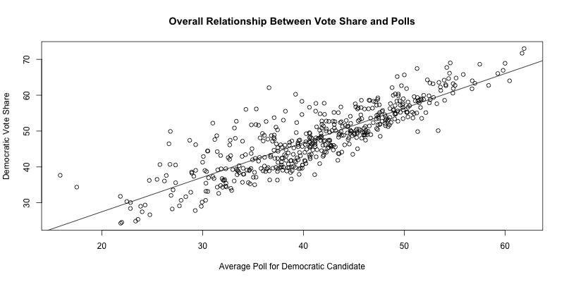
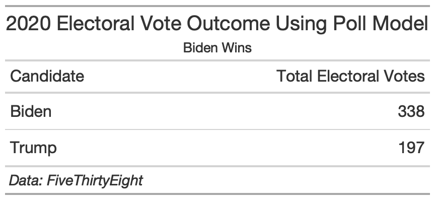
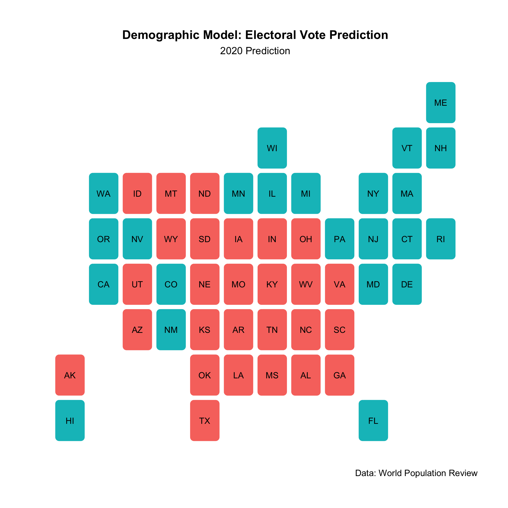
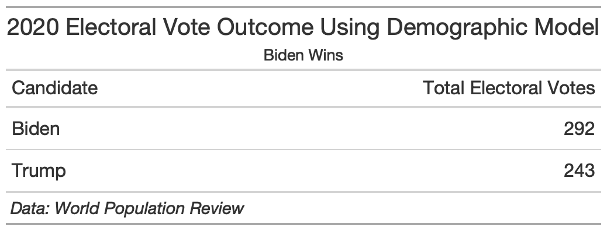
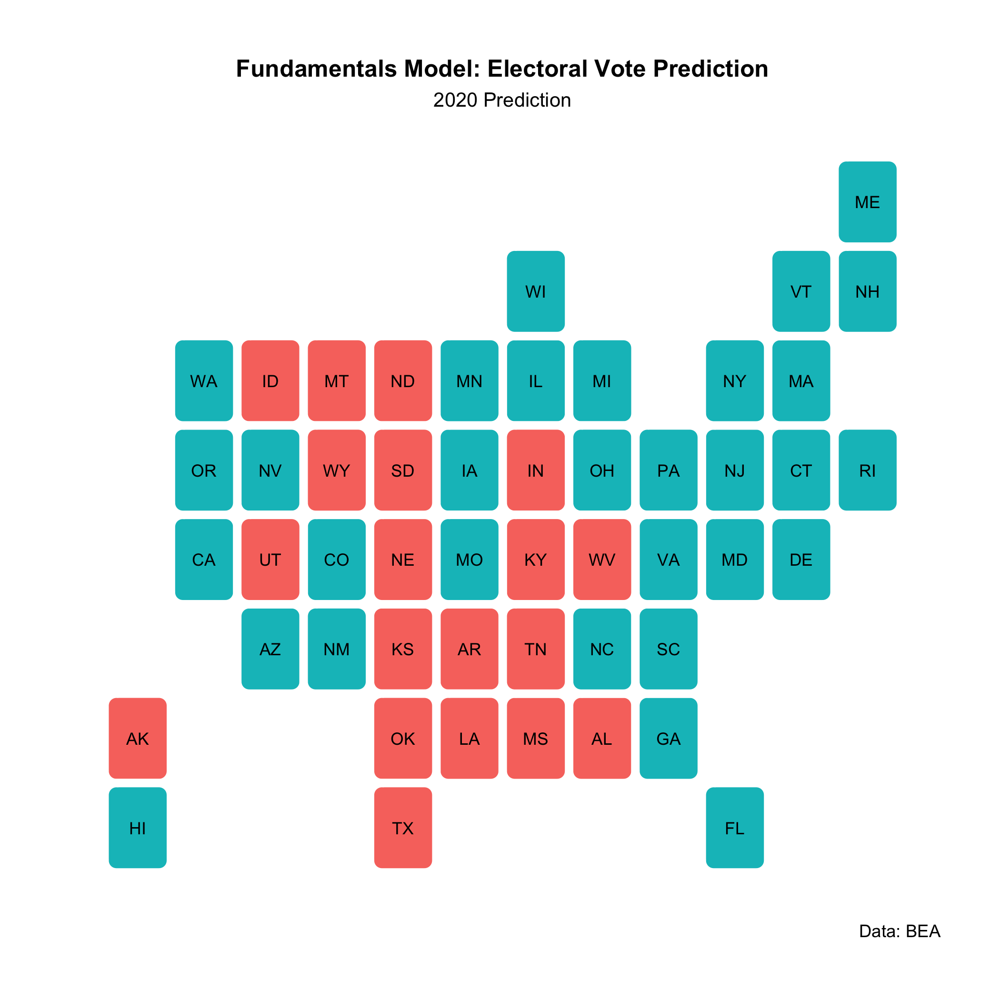
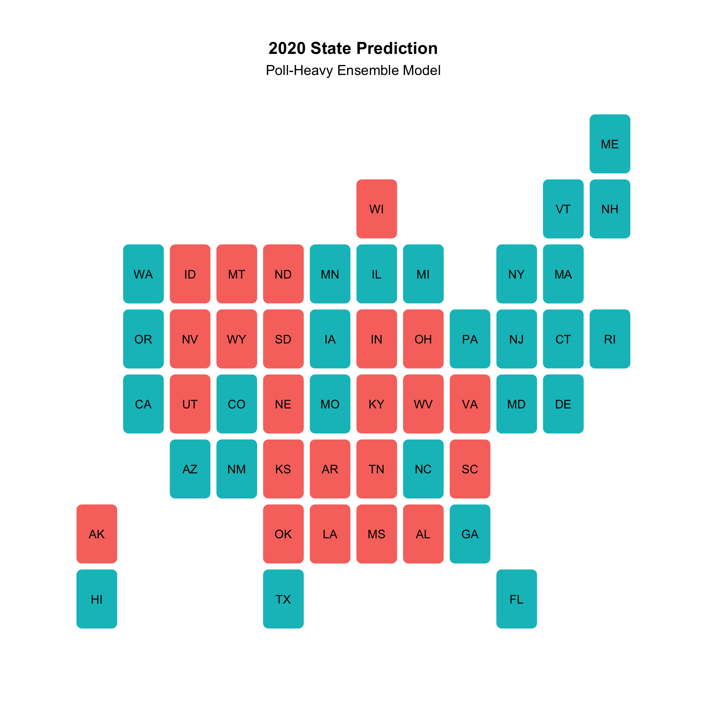
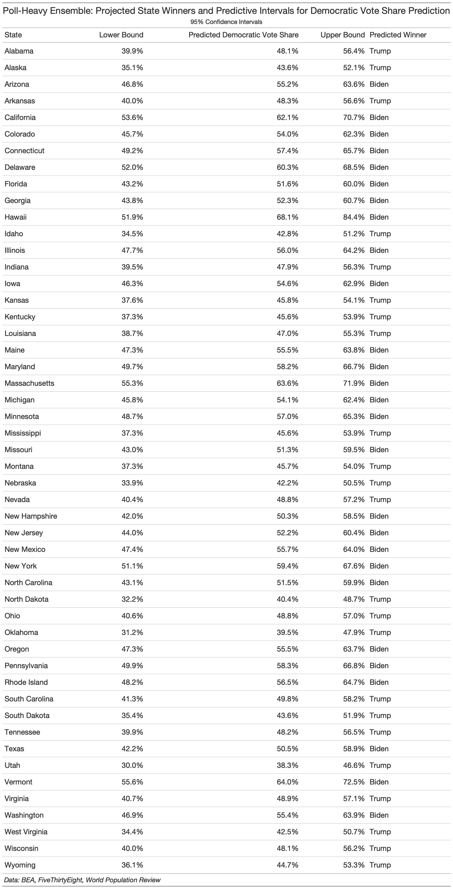
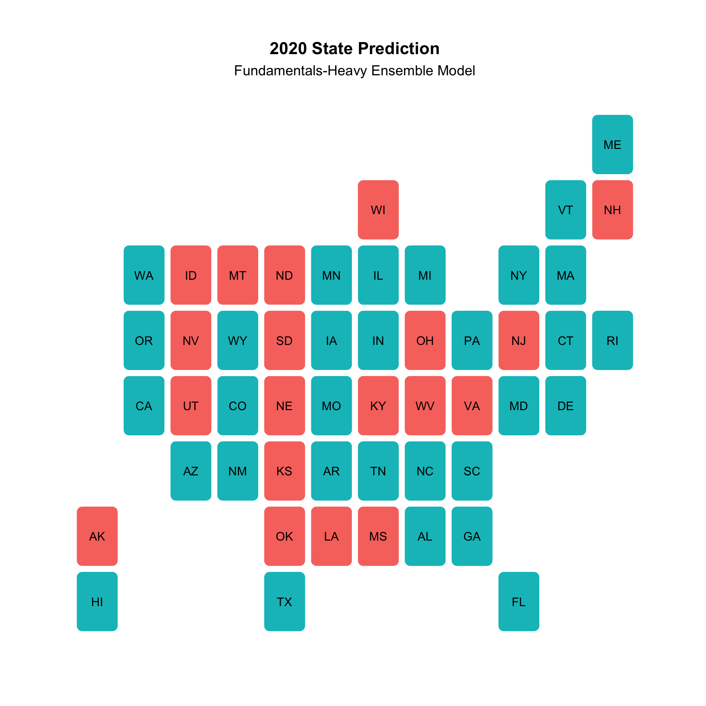

# Final Election Prediction
Today I'll walk you through a couple of models that predict the 2020 election. Due to available data, I specifically predict the democratic 2-party vote share and filter the data for democratic records only. 

I grappled with the following questions when doing this prediction:
- How much will fundamentals matter? Specifically, how much will economic factors matter given the unusual economic circumstances of the pandemic?
- How much will polls matter? 
- How much will demographic shifts matter? 

In the end, I create two models: 
1) An ensemble that gives my state poll model 50% of the predictive power and my state demographics model and state economics model 25% of the predictive power each. 
2) A model that combines state polls, incumbency, and state demographic shifts. 

But first, a quick look at Abramowitz's famous time-for-change model and my reasons for why it will not work in 2020. 

## Time-For-Change
Back in blog X I assessed TFC predictive power for national elections. Usually it does quite well:

It even successfully predicted 2016!

The model depends on fundamentals (GDP growth and incumbency) as well as polls. 

How would this model fair in 2020? I believe that TFC is not appropriate to predict 2020 because of this year's wildly unusual economic situation. Trump oversaw a booming economy and plunging unemployment numbers until the Covid crisis externally tanked the economy. I will assume for the rest of the blog post that voters will not factor economic considerations the way they usually do when retrospectively voting. What I mean by this is that when looking back on an incumbent president to decide to reelect or not, voters will not factor their economic well-being as heavily as they would have in the past. 

## My Proposed Model: Ensemble 
I propose a prediction that incorporates three models:
1) Poll Model
2) Demographics Model
3) Fundamentals Model 

### Poll Model Breakdown 
This model uses state-by-state polls from 1972 onward to predict Democratic vote share in each state using a linear regression. I took the average of polls up to 10 weeks away from election day for the democratic candidate. I use 10 weeks as the latest date because the closer a poll is to election day, the more it captures the public's sentiments toward a candidate. This is based on [Gelman and King's](https://www-jstor-org.ezp-prod1.hul.harvard.edu/stable/194212?seq=1#metadata_info_tab_contents) reasoning that over the course of the campaigning period, voters more clearly solidify their “enlightened” preferences as they gather more and more information on the candidates in question. 

The model outcome shows that there is a positive relationship between Democratic poll numbers and the Democratic vote share across all states. Each point on the plot below represents one state and shows the overall positive relationship between the variables: 

When you break the model down by state and predict the 2020 electoral outcome using state poll averages since 10/8/2020, this is the predicted outcome: 

This comes out to a Biden win with 282 electoral votes: 

### The Demographic Model 
This model uses state-by-state demographic changes in the Black, Hispanic, Asian, and White populations. As the country becomes more diverse and trends towards a majority-minority country, it is important to take into account the overall voting patterns of demographic groups. On average, with an increase in the Black, Asian, and Hispanic population come more votes for democrats. 

My model predicts Democratic vote share using the annual changes in the Black, Hispanic, Asian, and White populations in each state. Using 2020 demographics, my model predicts the following outcome for 2020: 

In this case, Biden would win with 289 electoral votes:

I don't want to put too much emphasis on this model, however, because demographic groups do not vote as a monolith and have changing tendencies. For instance, many have noted the Hispanics are voting more conservatively than in the past. While the model accounts for any state-based confounders by taking in to account trends in each state, it also lacks all demographic groups in the country. I just chose the major 3. Finally, there model doesn't have much data before the early 90s. While it is certainly informative, there are a few key shortcomings that make me hesitant to rely heavily on its outcomes. 

### The Fundamentals Model
This model predicts state-by-state Democratic vote share using annual GDP growth in each state and incumbency. 

This is the electoral outcome by state using GDP growth from the 2019 state-by-state average and quarter 2 state-by-state data for 2020 (could not find a year-long average): 

 

With this model, Biden smokes Trump with 390 electoral votes:

However, like I said, it is unclear how American voters will perceive the economy in this election and how much they will blame Trump for poor outcomes due to the Covid crisis. My guess going forward is that economic matters are less of a predictive factor than in the past. 

## My Ensemble: Poll-Heavy 
I decided to take the three models above and create a weighted ensemble with the following weights: 50% for the poll model prediction, 25%, for the demographics prediction, and 25% for the fundamentals prediction. 

I am leaning on the polls because given the uncertainty of the political moment, I trust the state-by-state polls to be a better indicator of electoral preference than the economy, which is currently in a historical flux. There's also the question of incumbency, which historically is a strong predictor. However, with this election and the polarizing figure that is Donald Trump, I look to the polls more than the fundamentals. 

Using this ensemble, the predicted state outcomes map for 2020 is the following: 

**Biden is projected to win** with **291** electoral votes. 

There is always, of course, some variance in the models used to predict election outcomes. This table captures the upper and lower bounds of my democratic vote share predictions for each state using a 95% confidence interval: 

I also wanted to consider the in-sample fit of the model. Essentially, how well does this model account for variance? I find the R-squared value to be **94.5%** which means the model describes 93.6% of the error. The other ~6% is random error that the model does not account for. Of course, over-fitting is a possibility, but overall, this high R-squared indicates that the model is a close fit to reality (it's predicted outcomes in the past fit the actual outcomes quite closely). 

I went on to consider the out of sample fit of my ensemble. Since I am using data across states over multiple years, it was tricky to find states that had consistent data each year in each state to compare out of sample predictions across models. What I ended up doing was starting with Florida, a swing state and key 2020 battleground state. I omitted 2004 from my ensemble, ran the model, and used the model outcome to predict Florida's outcome in 2004. When I compared this to the actual outcome, the out of sample prediction was only 0.77 democratic vote share points off. 

I went on to find two more states that had 2004 data in each model within the ensemble. I went ahead and did an out of sample prediction (omitting 2004 again) to predict the 2004 outcome in Alabama, Arizona, *and* Florida. I then found the difference with the true outcomes for each of these states in 2004 and found that the average difference from the true outcome was only 0.77 points. I take these small variations to be a good sign that my model is accurately predicting democratic vote share outcomes. 

### An Alternative Ensemble
To check my ensemble above and to compare to other potential outcomes, I changed the weights to reflect a more traditional fundamentals-heavy ensemble. In this iteration, the models are weighted like this: 25% for the poll model prediction, 25%, for the demographics prediction, and **50%** for the fundamentals prediction. 

This ensemble will especially take into accound the economic downturn caused by Covid, suggesting a huge hit to Trump's vote share and electoral votes.

The fundamentals-heavy ensemble predicts the following state-to-state outcome: 

Biden wins with a whopping **421 electoral votes**. 

This table breaks down the projected state-by-state democratic vote share and it's upper and lower bound (95% confidence interval) prediction: 

Interestingly, some states, like Idaho, Nevada, and Utah go from blue in the poll-heavy ensemble to red in the economic-heavy ensemble. Perhaps these states have not been as impacted by the Covid economic downturn and have better economic outcomes than the rest of the country. This would make sense given that they did not have major state-wide shut downs like Massachusetts or New York, allowing their economy to avoid massive shocks. 

### Why not this ensemble?
Theoretically, I do not belive that this ensemble is the most accurate prediction because of the weight it gives to economic considerations and incumbency. This is a year like no other with an economic shock like no other and a President like no other. Voters will have a difficult time discerning how much Trump helped or hurt the economy in the wake of Covid, especially after such a strong economic performance in the first three quarters of his presidency. As for incumbency, Trump is a polarizing figure that may not have (or lack) the usual incumbent advantage. Most likely, he will have an advantage among Republicans and a disadvantage among Democrats regarldess of his performance as president. This is consistent with rising polarization. 

The second ensemble also has a slightly lower R-squared value (93.6%). Again, with such a high R-squared, there could be some over-fitting involved. Nevertheless, this model still explains the relationship between my variables of choice and the Democratic vote share quite well. The problem is that in 2020, with such an exceptional election, models from the past may not capture the novelty of this political moment. For this reason, I use the poll-heavy ensemble to make my primary prediction because I feel it does the best job at addressing this critical and unpredictable time. 

## What to Expect on November 3rd
According to my ensemble of choice, look for the following on election day: 
- Biden wins with 291 electoral votes 
- Trump gets 244
- Biden bags Pennsylvania, Ohia, Iowa, and Arizona - all critical batteleground states
- Trump takes home Florida and North Carolina

