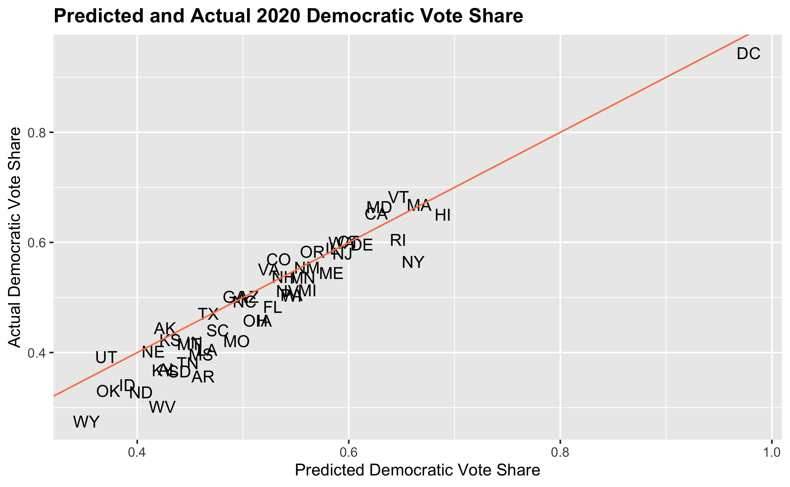

# Post-Election Analysis: How My Prediction Stacks Up
Today I will look back at my pre-election prediction and compare it to the 2020 presidential election outcomes. In doing so, I not only correct a mistake in my prediction, but indentify the areas where my - and many other - electoral predictions are lacking. My main takeaway is that an increasingly polarized US necessitates a new approach to election forecasting and the pieces that go into predictions. 

My prediction and its shortcomings contained the following themes:
- Americans are increasingly polarized in their views, with red states voting more for Trump than the model predicted they would have with historical data 
- Polls over-predicted the demcratic vote share, leaving us with a much closer election than expected 
- The use of fundamentals is still important - the economy was a huge factor - but the interpretation of fundamentals was largely polarized 
  - For example, exit polls suggest that in predominantly red states, voters that sided with Trump were most concerned about the economy, indicating that Trump has handled the economy well, whiile Democratic voters have highly criticized Trump's economic performance

In this blog post I will do the following: 
- address and correct a mistake in my pre-election prediction
- describe my predictive model
- compare my prediction to the actual outcome 
- propose some hypotheses as to why my prediction went wrong 
- propose tests to assess my hypotheses
- propose some changes I could have made to my model

## Recap of Model and Predictions 
### CORRECTION
The week before the election I created a predictive model (a poll-heavy weighted ensemble) that placed Biden as the victor with **372** electoral votes and Trump with **163.** 

However, this week, after assessing my prediction and comparing to the actual election outcome, *I found a mistake in my pre-election prediction* that led to the dropping of DC from the prediction as well as a misordering of the predictions by state. Once I corrected the mistake and reported it to course instructors, my model updated to a Biden victory with **358** electoral votes and a Trump loss with **180** electoral votes. (I also explored an alternative weighted ensemble that was fundamentals-heavy: 50% weight on a fundamentals model like economy and incumbency, and 25% each of demographic and poll models. With my code update, the totals changed from 403 Biden and 132 Trump to 368 Biden and 170 Trump.)

My updated weighted ensemble of choice (poll-heavy) had the following electoral prediction:

I did not, in any way, change the variable and weights in my model. Here is a map of the *updated* state-by-state victor and popular vote outcomes (with confidence intervals): 

(In the interest of being fully transparent about my mistake, I've kept my [original prediction](https://carine-h.github.io/posts/blog_8.html) post up with an updated disclaimer at the bottom. The botched code is also still available along with the corrected code used for today's assessment (see my [github](https://github.com/carine-h)). If you have any more questions about the mistake or my correction, feel free to email me at cmhajjar@college.harvard.edu. Going forward, I will only be referring to my updated prediction and will denote this in each plot using my corrected prediction data by noting it's "corrected.")

### How I Stacked Up With the Election's Outcome
My prediction, though updated and corrected, still did not capture the true outcome of the election. I overpredicted Biden's margin of victory, misrepresenting an election that turned out to be rather close. As of November 22nd, 2020, President Elect Biden has **306** electoral votes with a popular vote share of 51.1% and President Trump has **232** electoral votes with a popular vote share of 47.2%, indicating a decisive Biden victory. 

So how exactly did I build my prediction? 

My model was a weighted ensemble that combined a fundamentals model, a demographic model, and a polls model. The fundamentals and demographics model had 25% weights, each, while the polls model had a 50% weight, making this a **poll-heavy** predictive model. Below are the variables for each of the ensemble components:
- Fundamentals: average annual state GDP growth and incumbency (I used quarter 2 GDP growth for 2020 due to limited data availability)
- Demographics: state-by-state demographic changes from in the Black, Hispanic, Asian, and White state populations (holding the demographic changes among gender and age as 0 between 2018 and 2020 due to lack of data)
- Polls: state-by-state presidential polls from 1972 onward, taking the average of polls up to 10 weeks away from the election

I chose a poll-heavy model for a variety of reasons. First and foremost, I felt that fundamentals, a traditionally robust predictor of elections, would be less useful this time around. The economy, for instance, has gone into an unusual shock from the COVID crisis. Incumbency is also different this time around - there has never been such a polarizing president as Donald Trump. Therefore, I was weary to place heavy weight on fundamentals during such a singular election. I also only placed 25% of the ensemble weight on demographics because I did not want to generalize that demographic groups vote as a monolith. Moreover, I only factored in Black, White, Hispanic, and Asian groups (due to data availability) and did not want to throw the model off with a rather simplistic view of the country's makeup. 

# A Comparison to the Actual Outcome 
It's important to visually and computationally assess my model's performance in comparison to the actual outcome. To do so, I used the follwing: 
- an RMSE calculation 
- a classificaation accuracy calculation
- various visual comparissons. 

### RMSE
When comparing my state-by-state Democratic vote share prediction to the actual outcome, I end up with an **RMSE of 4.73 points**. RMSE (or root mean squared error) is an absolute measure of a prediction's fit to the actual outcome, or, more accurately, the square root of the variance. Basically, it is a way to assess the distance between the prediction and outcome. A larger RMSE denotes a less accurate prediction. An RMSE of 4.73 points means that, on average, there was a square root of the variance of 4.73 points between my prediction and the actual outcome of the state-by-state democratic vote share. In an election as competitive as this one, 5 points could be the difference between losing and winning a key state (and often was!). In Florida, a key swing state, the [vote margin](https://abcnews.go.com/Politics/florida-2020-election-results/story?id=73572366) was under four points!

### Classification Accuracy 
I also assessed the classification accuracy of my prediction against the outcome. To do so, I divided the total states I accurately predicted over the total number of states (51 inclusing DC). I correctly predicted 46 out of 51 states, bringing me to a classification accuracy of 90%. 

### Graphical Comparisons
Finally, I was able to visually capture the comparisons between my prediction and the actual outcome. 

First, here's a side-by-side map comparison of state winners: 

- The map shows that I missed the following: 
  - Florida, Iowa, Ohio were all expected to go to Dems, but were won by Trump 
  - Georgia was predicted to go to Republicans, but was won by Biden 
  - Overall, my mistakes were in highly-contested swing states 

I also took a look at the residuals of my prediction against the actual outcome in the following histogram: 

- The blue dotted line denotes a mean difference of about 2.8 points between all of my predicted democratic vote share outcomes and the actual democratic vote share outcomes
- The histogram shows that the most frequent residual value was about 5 points difference

Lastly, I created a scatter plot that plotted the predicted state democratic vote shares against the actual democratic vote share: 

- This plot reveals the following key patterns: 
  - For most states, I overpredicted the democratic vote share 
  - Biden's vote share was especially overpredicted in traditionally red states like OK, AR, TN, etc. 
    - While Trump won these states, the overprediction indicates that polls and classical indicators in predictive models (like the economy) have fallen victim to polarization - in predominantly Republican states, there was a more favorable analysis of these factors for Trump than there would have been in pblue states

## Where I Went Wrong
I propose three major hypotheses for my model's pitfalls: 
1. The polls fell flat, yet again
2. Some voters presumably considered the strength of the economy independent of the COVID shock, bringing fundamentals back into play 
3. My prediction did not account for the [highly polarized](https://time.com/5907318/polarization-2020-election/) nature of this election

#### Polls
Currently, a common theme in the media is the issues with polling and the shortcomings in the polls both now and in 2016. After all, the polls did underweigh Trump support in 2016, just as they did this year. 

So, why did I place so much weight on the polls knowing their past flaws? 

For one, I naively assumed that pollsters would have learned their lesson from 2016: they would have cracked the code on detecting Trump support. This assumption was obviously incorrect. I also chose a poll-heavy prediction because I hoped that polls would be a better indicator of electoral preference on the state level while all other traditional indicators are in flux. 

This model composition intuitively made sense  - the economy is a mess and Trump is a one-of-a-kind president so the best thing to do is rely on the polls. However, throughout the process, my gut told me it would be a close race, perhaps even a race that Trump would still win - while it's easy to feel that Biden is a more palatable candidate, I had to remind myself that Harvard's thought bubble is especially liberal. So many other places around the country still sympathize with Trump and even feel good about his leadership over the past almost-four years. In this context, I hoped my model would reflect a close race. Though it did not in the end, I nonetheless trusted the polls, looking to them as the only possible measure during such an unusual election. 

#### Economy 
I used GDP growth in each state as part of the fundamentals piece in my ensemble. This was problematic for a few reasons. 

For one, the economy is in rather rough shape due to the COVID shock and the 2rd quarter (which was my 2020 data for the prediction) only reflects a snapshot of a presidency that, pre-COVID, had relatively strong economic outcomes. By predicting electoral outcomes with this small, abysmal snapshot of the economy, I may have underestimated Trump's performance. In fact, [exit polls](https://www.vox.com/2020/11/4/21548770/exit-polls-election-trump-voters-economy-pandemic) seem to indicate that voters- mostly on the right- have high approval of Trump's handling of the economy and trust him in repairing it more than Biden. This is indicative of a sort of retrospection on a polarized timeline. 

In other words, Republican voters may be retrospectively voting in a way that looks back at the entire presidency, taking into account the better economic periods. Democratic voters may just be taking into account the recent economic downturn and blaming it fully on Trump. Moreover, as this [Pew](https://www.pewresearch.org/fact-tank/2020/11/06/2020-election-reveals-two-broad-voting-coalitions-fundamentally-at-odds/) article suggests, Democrats do not care as much about the economy as Republicans. They are more broadly concerned with healthcare and COVID management. Either way, Democrats are probably more critical of Trump's economic management, especially given the COVID shock to the economy.

Overall, it seems that the economy is widely polarized, with Republicans both paying more attention to it and taking a broader look at Trump's presidency while Democrats are more concerned about COVID, presumably placing more blame on Trump for the recent economic downturn.

#### Polarization
I believe polarization is the greatest flaw in my model (and other popular models) because there are essentially two groups of voters (pro and anti-Trump) that assess fundamentals, shocks, and other considerations that go into voting in totally different ways based on their partisan affiliation. 

Take the economic example above - Republican voters look at the economy in a totally different way than Democrats. 

More and more, voters are resorting to their party affiliation to decide their votes. Therefore, it's tough to look at a metric like demography or the economy to measure election outcomes across groups. In other words, if two parties look at these metrics in totally different ways, it's hard to make a prediction based on these measures without accounting for polarized perceptions. 

### Testing These Hypotheses
In order to test my hypotheses about the flaws in my prediction, I could do the following for each component: 
- Compare exit polls to pre-election polls to compare the discrepancies in demographical and ideological representation in the polls 
- Measure the "shy Trump effect" by conducting a randomized, confidential survey of Republicans to understand which were comfortable saying they were going to vote for Trump and that were not
  - Compare to the national polls to calculate a discrepancy between reported and actual intentions to vote for Trump among Republicans
- Conduct a randomized survey of Americans to assess each candidate on their economic performance, their COVID-response, and their overall job approval 
  - Have respondents report their ideology 
  - Compare approval in each category across partisan lines to find a measure of polarization
  - Look specifically at the economic assessment to understand if predominantly Republican states were more favorable on Trump's economic performance than Democrats were 

### Addressing my Shortcomings
Given the available information, if I could go back in time, I would change my model in the following ways: 
- Use an average of GDP growth rather than just the 3rd quarter 
- Incorporate state-by-state economic approval in the fundamentals piece of the ensemble 
- Look at the interaction between state-by-state job approval and state-by-state polarization
- Weigh my polls less heavily and weight the job approval interaction more heavily

## Conclusion
It was a huge surprise when the model produced a Biden landslide. However, I stood by the logic of my model's parameters and hoped that they'd hold some kind of truth. Though I was wrong in the end, the gap between the model and reality signaled the following rather scary reality: there is really no good indicator for presidential outcomes in an election like 2020's. I chalk this up to deeper polarization and partisanship. No matter what the polls say or how much GDP grows/shrinks, it seems that Americans have made their minds up. Fundamentals, public opinion, and even demographics fall to the wayside when Americans have already chosen their "camps."
